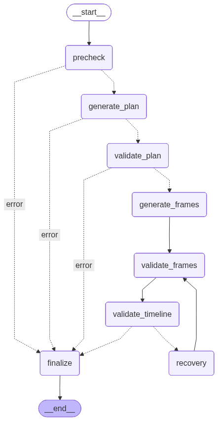

# ai-video-studio（AI 短剧/影视剧制作工作流平台）

面向专业短剧制作团队的 AI 生产工作流平台。当前工程主线是
`audio -> timeline -> clip -> render -> export`：`Timeline` 是剧集可播放输出
的单一事实来源（SSOT），Storyboard 保留为视觉支撑视图和兼容面。平台仍覆盖
虚拟 IP、故事（Story）、分集（Episode）、剧本（Script）以及图像/文本/音频/视频
模型集成与 OSS 存储。

## 仓库结构

- `ai-pic-backend/`：FastAPI + SQLAlchemy + Alembic + Celery（MySQL/Redis）
- `ai-pic-frontend/`：Next.js 16（App Router）+ TypeScript + Tailwind
- `docker/`：本地开发/生产 Docker 编排与 Nginx 入口
- `docs/`：设计/接口/测试指南索引（见 `docs/README.md`）
- `tasks.md`：项目任务看板（唯一权威）

## 快速开始（5-10 分钟 Lite 模式）

Lite 模式用于快速体验和本地联调：后端使用 SQLite，Celery 任务在进程内 eager 执行，并默认启用 AI mock 回退，不依赖 MySQL/Redis/独立 worker。

1. `cd docker`
2. `./init_env.sh lite`
3. `./dev_lite_in_docker.sh`

访问：

- Web（Nginx 入口）：`http://localhost:8089`
- Backend API（直连）：`http://localhost:8000`（Swagger：`http://localhost:8000/docs`）

Lite 默认关键配置（可在 `docker/.env.lite` 调整）：

- `DATABASE_URL=sqlite:////app/ai-pic-backend/uploads/dev_lite.db`
- `CELERY_TASK_ALWAYS_EAGER=true`
- `AI_FORCE_MOCK=true`
- `SQLITE_MIGRATION_FALLBACK_CREATE_ALL=true`（SQLite 遇到不兼容 Alembic 迁移时自动回退初始化）

## Harness 工作流

默认 harness 入口：

- `scripts/harness/bootstrap_worktree.sh --mode lite`
- `python scripts/harness/doctor.py --run-id <run_id>`
- `python scripts/harness/browser_flow.py --scenario login_smoke --run-id <run_id>`
- `python scripts/harness/run_golden_path.py --scenario mock_smoke --run-id <run_id>`
- `python scripts/harness/query_logs.py --run-id <run_id>`
- `python scripts/harness/query_metrics.py --run-id <run_id>`
- `python scripts/harness/trace_run.py --run-id <run_id>`
- `python scripts/harness/trace_task.py --task-id <task_id>`
- `python scripts/harness/score_quality.py --run-id <run_id> --write-quality-score`

所有 harness 证据写入 `artifacts/runs/<run_id>/`，默认包含 `manifest.json`、`summary.json`、`browser_flow.json`、`console.json`、`network.json`、`dom_snapshot.json`、`screenshot.png` 与场景截图目录。Contract audit 会写入 `artifacts/repo_audit/latest/`。

## 完整 Docker 开发栈（MySQL/Redis/Celery）

1. `cd docker`
2. `./init_env.sh dev` 并填写必要配置（至少 `DATABASE_URL`、`REDIS_URL`、`SECRET_KEY`；AI Key 按需）
3. `./dev_in_docker.sh`

服务容器名：

- `ai-video-nginx` / `ai-video-frontend` / `ai-video-backend`
- `ai-video-celery-worker` / `ai-video-celery-beat`
- `ai-video-mysql` / `ai-video-redis`

数据库迁移：

- 容器启动时会自动执行 `alembic upgrade head`（见 `docker/backend-entrypoint.sh`）。
- 如果你**只更新了代码但没重启后端**，可能出现 “Unknown column …” 这类 500。
- 可先执行自动诊断：`cd docker && ./migration_guard.sh check dev`
- 一键修复：`cd docker && ./migration_guard.sh fix dev`
- 仅预览修复动作：`cd docker && ./migration_guard.sh fix dev --dry-run`

## 配置入口（dev/prod/lite）

- `cd docker && ./init_env.sh dev`：初始化开发栈配置到 `docker/.env`
- `cd docker && ./init_env.sh prod`：初始化生产栈配置到 `docker/.env`（模板：`docker/.env.prod.example`）
- `cd docker && ./init_env.sh lite`：初始化轻量栈配置到 `docker/.env.lite`

## 本地开发（不使用 Docker）

### 后端

```bash
cd ai-pic-backend
cp env.example .env

pip install -r requirements.txt -r requirements-test.txt
alembic upgrade head
uvicorn main:app --reload --host 0.0.0.0 --port 8000
```

### 前端

```bash
cd ai-pic-frontend
npm install

# 指向后端 API（示例：直连 8000）
export NEXT_PUBLIC_API_URL=http://localhost:8000

npm run dev
```

## 提示词与“故事形态”（短剧/电视剧/电影）

系统对不同体裁的提示词支持**按故事形态分流**：

- `story_format`：`short_drama`（默认）、`tv_series`、`film`
- 前端在“AI 生成故事”面板提供“故事形态”下拉，后端会选择对应提示词变体
- 提示词模板目录：`ai-pic-backend/app/prompts/templates/`

命名约定（在不改调用方的前提下分流）：

- 基础模板：`story_outline` / `system_prompt_story` / `system_prompt_script` / `episode_generation` / `script_scenes`
- 变体模板：`<base>_tv_series`、`<base>_film`

解析逻辑位于：

- `ai-pic-backend/app/prompts/template_resolver.py`
- `ai-pic-backend/app/prompts/manager.py`

## 故事导出“知乎体小说”（1–3 万字）

- 入口：故事详情页 → `导出知乎体小说`
- 方式：异步任务 + Celery worker；页面会轮询任务进度，完成后可下载 `.txt`
- 后端接口：
  - `POST /api/v1/stories/business/{story_business_id}/novel/generate-async`
  - `GET /api/v1/stories/novel/tasks/{task_id}/download`
- 提示词模板：`system_prompt_novel_zhihu` / `story_novel_zhihu_plan` / `story_novel_zhihu_chapter`
- 导出落盘：`uploads/exports/novels/`
- 导出入库：`story_novel_exports`（关联 `tasks.id` / `stories.id`，正文存 `content_text`；下载接口在文件缺失时会回退读取数据库）

## Agent 状态图（真实 LangGraph）

LangGraph 支持将状态机导出为 Mermaid/PNG。仓库内只为实际构建 `StateGraph` 的生成链路生成状态图，便于理解流程与排查问题。`StoryLangGraphAgent` 和 `EpisodeLangGraphAgent` 当前是 structured repair loop，类名与 `generation_method` 值仅为兼容保留，不作为 LangGraph 图列出。

- 生成脚本：`python scripts/generate_agent_graphs.py`
- 输出目录：`docs/agent_graphs/`（`.png` + `.mmd`）

<details>
<summary><code>ScriptLangGraphAgent</code>（剧本生成）</summary>


源码：`docs/agent_graphs/script_langgraph_agent.mmd`

</details>

<details>
<summary><code>StoryboardPipeline</code>（显式分镜管线）</summary>



源码：`docs/agent_graphs/storyboard_pipeline.mmd`

</details>

<details>
<summary><code>StoryboardReActReasoner</code>（分镜规划+评审+生成）</summary>


源码：`docs/agent_graphs/storyboard_react_reasoner.mmd`

</details>

<details>
<summary><code>TimelineLangGraphAgent</code>（legacy 对白节奏/间隔计算）</summary>


源码：`docs/agent_graphs/timeline_langgraph_agent.mmd`。主链路默认使用 `TimelineReactAgent`，该图保留用于兼容路径排查。

</details>

<details>
<summary><code>DurationOrchestratorAgent</code>（experimental 端到端时长闭环验证）</summary>


源码：`docs/agent_graphs/duration_orchestrator_agent.mmd`。当前按实验性时长编排链路记录，不列为默认主生产链路。

</details>

## 常用验证命令

```bash
# backend
cd ai-pic-backend && pytest

# frontend
cd ai-pic-frontend && npm run lint
```

## 文档入口

- 总索引：`docs/README.md`
- 架构约束：`ARCHITECTURE.md`
- 前端规则：`FRONTEND.md`
- 可靠性与 trace：`RELIABILITY.md`
- 安全约束：`SECURITY.md`
- 质量面板：`QUALITY_SCORE.md`
- Docker 栈：`docker/README.md`
- 后端说明：`ai-pic-backend/README.md`
- 前端说明：`ai-pic-frontend/README.md`

## Troubleshooting

- `/stories` 等页面显示“空/加载失败”，后端日志出现 `Unknown column 'stories.story_format'`：
  - 说明数据库未升级到最新 schema；运行 `alembic upgrade head`（Docker 用 `docker exec ai-video-backend …`）。
- 小说导出任务一直 `pending/processing`：
  - 确认 Redis/Celery worker 正常运行（Docker 栈中为 `ai-video-celery-worker`），并查看 worker 日志。
- Nginx 入口偶发 `502 Bad Gateway`（Docker 容器 IP 变更导致 upstream 缓存）：
  - 重启 Nginx：`docker restart ai-video-nginx`。
