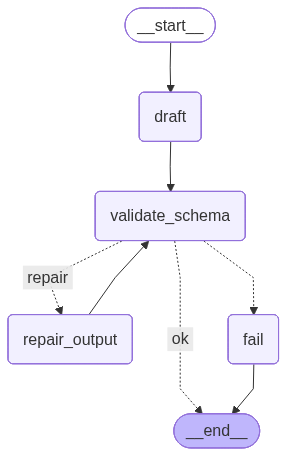
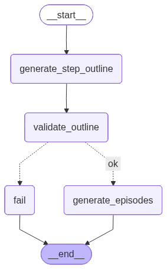
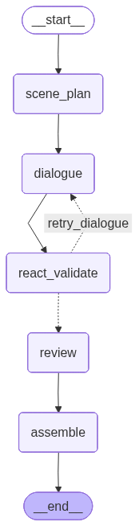
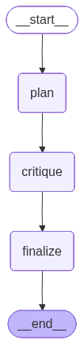
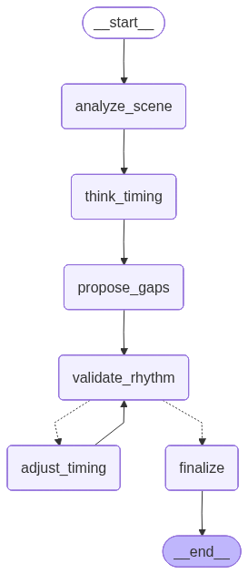
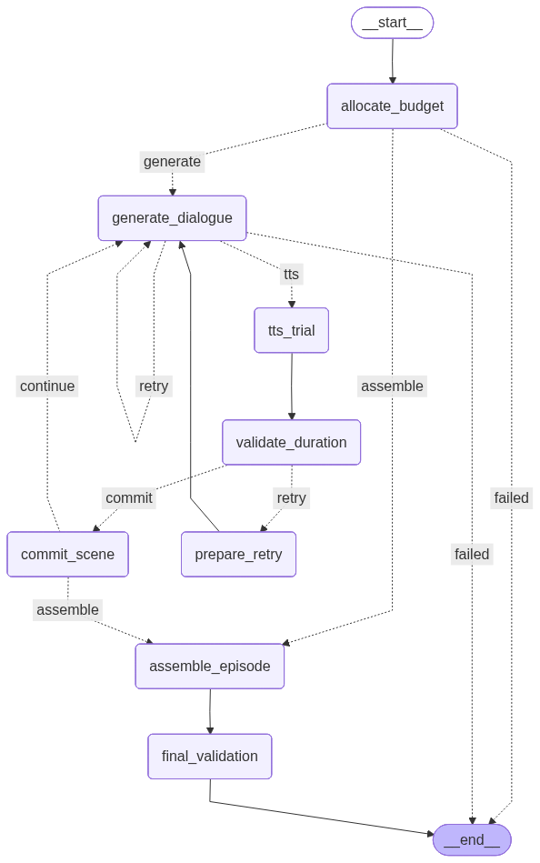

# ai-video-studio (AI Short-Drama / Film & TV Production Workflow)

An AI-powered, **virtual-IP–centric** content production platform that covers Story → Episodes → Scripts, integrates multiple model providers (text/image/video), and supports OSS-backed asset storage.

## Repository layout

- `ai-pic-backend/`: FastAPI + SQLAlchemy + Alembic + Celery (MySQL/Redis)
- `ai-pic-frontend/`: Next.js 16 (App Router) + TypeScript + Tailwind
- `docker/`: Docker dev/prod stacks + Nginx entrypoint
- `docs/`: design/API/testing docs index (see `docs/README.md`)
- `tasks.md`: canonical task board

## Quick start (recommended: Docker dev stack)

1. `cd docker`
2. `cp .env.example .env` and fill required values (at least `DATABASE_URL`, `REDIS_URL`, `SECRET_KEY`; AI keys as needed)
3. `./dev_in_docker.sh`

Endpoints:

- Web (Nginx entrypoint): `http://localhost:8089`
- Backend API (direct): `http://localhost:8000` (Swagger: `http://localhost:8000/docs`)

Key containers:

- `ai-video-nginx` / `ai-video-frontend` / `ai-video-backend`
- `ai-video-celery-worker` / `ai-video-celery-beat`
- `ai-video-mysql` / `ai-video-redis`

DB migrations:

- On container start, backend automatically runs `alembic upgrade head` (see `docker/backend-entrypoint.sh`).
- If you **updated code without restarting** the backend, you may see 500s like “Unknown column …”. Fix with: `docker exec ai-video-backend alembic upgrade head`, then reload the page.

## Local development (without Docker)

### Backend

```bash
cd ai-pic-backend
cp env.example .env

pip install -r requirements.txt -r requirements-test.txt
alembic upgrade head
uvicorn main:app --reload --host 0.0.0.0 --port 8000
```

### Frontend

```bash
cd ai-pic-frontend
npm install

# Point the UI to your backend API (example: direct 8000)
export NEXT_PUBLIC_API_URL=http://localhost:8000

npm run dev
```

## Prompt templates & `story_format` (short drama / TV series / film)

Prompts are **format-aware** via `story_format`:

- `story_format`: `short_drama` (default), `tv_series`, `film`
- The “AI Generate Story” form includes a format selector; backend resolves prompt variants automatically.
- Templates live under: `ai-pic-backend/app/prompts/templates/`

Naming convention (no caller-side changes needed):

- Base templates: `story_outline` / `system_prompt_story` / `system_prompt_script` / `episode_generation` / `script_scenes`
- Variants: `<base>_tv_series`, `<base>_film`

Resolver implementation:

- `ai-pic-backend/app/prompts/template_resolver.py`
- `ai-pic-backend/app/prompts/manager.py`

## Export “Zhihu-style” novel (10k–30k words)

- Entry: Story detail page → `Export Zhihu-style novel`
- Flow: async Task + Celery worker; the page polls task progress and provides a `.txt` download when completed
- Backend endpoints:
  - `POST /api/v1/stories/business/{story_business_id}/novel/generate-async`
  - `GET /api/v1/stories/novel/tasks/{task_id}/download`
- Prompt templates: `system_prompt_novel_zhihu` / `story_novel_zhihu_plan` / `story_novel_zhihu_chapter`
- Output directory: `uploads/exports/novels/`
- Persisted in DB: `story_novel_exports` (linked to `tasks.id` / `stories.id`, full text stored in `content_text`; download falls back to DB when the file is missing)

## Agent state graphs (LangGraph)

LangGraph can export state machines to Mermaid/PNG. This repo snapshots the current major agent flows as diagrams for easier onboarding and debugging:

- Generate diagrams: `python scripts/generate_agent_graphs.py`
- Output directory: `docs/agent_graphs/` (`.png` + `.mmd`)

<details>
<summary><code>StoryLangGraphAgent</code> (conceptual story-outline flow)</summary>



Source: `docs/agent_graphs/story_langgraph_agent.mmd`

</details>

<details>
<summary><code>EpisodeLangGraphAgent</code> (conceptual episode-generation flow)</summary>



Source: `docs/agent_graphs/episode_langgraph_agent.mmd`

</details>

<details>
<summary><code>ScriptLangGraphAgent</code> (script generation)</summary>



Source: `docs/agent_graphs/script_langgraph_agent.mmd`

</details>

<details>
<summary><code>StoryboardReActReasoner</code> (plan → critique → finalize)</summary>



Source: `docs/agent_graphs/storyboard_react_reasoner.mmd`

</details>

<details>
<summary><code>TimelineLangGraphAgent</code> (rhythm / gap timing)</summary>



Source: `docs/agent_graphs/timeline_langgraph_agent.mmd`

</details>

<details>
<summary><code>DurationOrchestratorAgent</code> (end-to-end duration control loop)</summary>



Source: `docs/agent_graphs/duration_orchestrator_agent.mmd`

</details>

## Common validation commands

```bash
cd ai-pic-backend && pytest
cd ai-pic-frontend && npm run lint
```

## Docs entrypoints

- Docs index: `docs/README.md`
- Docker stack: `docker/README.md`
- Backend: `ai-pic-backend/README.md`
- Frontend: `ai-pic-frontend/README.md`

## Troubleshooting

- Stories list appears empty / loads fail; backend logs show `Unknown column 'stories.story_format'`:
  - Your DB schema is behind; run `alembic upgrade head` (Docker: `docker exec ai-video-backend …`).
- Novel export tasks stay `pending/processing`:
  - Ensure Redis/Celery worker is running (Docker: `ai-video-celery-worker`) and check worker logs.
- Nginx entrypoint returns `502 Bad Gateway` after container restarts (upstream IP caching):
  - Restart Nginx: `docker restart ai-video-nginx`.
