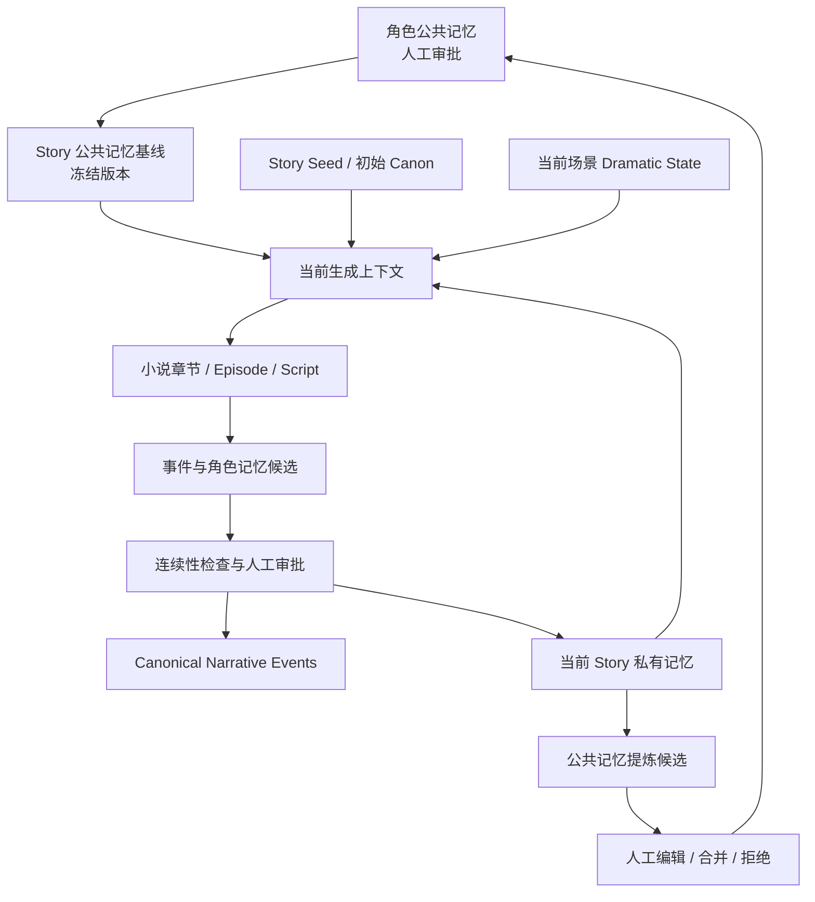

# 叙事记忆、角色成长与潜台词设计

> Status: Implemented (v1)
> Updated: 2026-07-23
> Applies to: new narrative-series workflows only
> Related: `docs/design/story-novel-episode-script.md`,
> `docs/design/story-episode-generation-quality.md`,
> `docs/design/production-canvas.md`
>
> The memory mechanism remains implemented v1. Its compatible StorySeed v2
> integration is tracked separately in
> `docs/exec-plans/active/structured-outline-platform-lengths.md`.

## 1. Decision

长篇叙事需要一套版本化、带锚点、可审批的叙事记忆机制。它不是通用
Agent memory，也不是把所有历史文本放进向量库，而是当前创作分支中可复现的
叙事状态。

系统采用以下边界：

- 客观世界真相由 Canon Facts 和 Narrative Events 表达。
- 每个角色拥有独立的主观记忆、信念、知情范围和成长状态。
- 所有自动提取的事件、记忆和成长变化先进入候选状态，不能直接成为 canonical。
- 所有记忆默认是 `story_private`，只允许当前 Story 使用。
- 角色公共记忆是 `character_shared`，只能从 Story 私有记忆中人工提炼、编辑和审批。
- Story 创建或开始生产时冻结每个角色的公共记忆基线；公共记忆后续升级不得静默污染在制 Story。
- 记忆必须引用稳定的发生、获知和生效锚点；生成只能读取当前锚点之前已经生效的记忆。
- “已经发生但不表现”属于客观事件与观众显隐状态；“潜台词”属于场景意图，二者不能塞进角色记忆代替。
- Story 生成使用轻量、可编辑的结构化 `StorySeed`；v2 可以确认小说章节结构，
  但不保存平台字数、生成模型、任务状态、正文或分集/拍摄规划。
- 审批小说仍是新系列的叙事 SSOT，Timeline 仍是制作时间、clip 顺序、资产谱系和交付 SSOT。

## 2. Why

当前链路已经有 Story 快照、小说版本、章节摘要、Episode 来源锚点和
`ContinuityLedger`，但它们还不能完整回答长篇生成中的关键问题：

1. 客观上发生过什么？
2. 某个角色在当前情节位置知道什么、误解什么、忘记什么？
3. 角色的目标、关系、能力和价值观如何成长到当前状态？
4. 一个事件虽然已经发生，是否向角色或观众展示过？
5. 当前对白应直接表达、只做暗示，还是严格禁止说破？
6. 上游章节修改后，哪些记忆和下游内容已经失效？
7. 同一角色在不同 Story 中的经历如何隔离，又如何经人工筛选成为公共经历？

只保存 `facts: List[str]` 会造成全知角色、知识泄漏、关系重置和无法追溯。
只保存章节摘要则会丢失事件发生位置、知情时机和来源版本。

## 3. Goals

- 支撑长篇小说、多集短剧和剧本连续生成。
- 保证 Story 之间默认隔离，不发生跨故事记忆污染。
- 允许人工把有长期价值的故事经历提升为角色公共记忆。
- 明确区分世界真相、角色记忆、角色信念和观众知情状态。
- 为倒叙、插叙、离场事件、误解、谎言、潜台词和延迟揭示提供结构化表达。
- 让任意一次生成都能记录并复现所使用的记忆快照。
- 在源内容修改时确定性标记受影响的事件、记忆、快照和下游内容。
- 给编辑提供可理解、可审核、可比较的 UI，而不是直接暴露原始 JSON。
- 删除 Story、Novel、Episode 和 Script 之间重复的规划与连续性校验。

## 4. Non-goals

- 不在 v1 引入向量数据库、图数据库或自主记忆代理。
- 不自动迁移历史 Story、小说、Episode 或 Script。
- 不把未审批草稿、模型猜测或聊天内容直接写入公共记忆。
- 不自动把一个 Story 的私有记忆传播到另一个 Story。
- 不因上游记忆变化自动重写 Episode、Script 或 Timeline。
- 不做逐句、逐 token 的全文事实索引。
- 不让 Timeline 成为叙事记忆的编辑入口。
- 不把角色临时情绪全部永久化；只有经过筛选的状态变化进入长期记忆。
- 不把 Story Seed 降成无约束自由文本；初始角色、世界边界和核心冲突仍需结构化。

## 5. Terms

### 5.1 Canon Fact

当前 Story 分支中已经审批的客观真相，例如世界规则、真实身份、真实关系、
不可违反的能力边界和已确认事件结果。

### 5.2 Narrative Event

在叙事世界中发生的事件。事件可以在画面内发生，也可以离场发生；可以已向观众
揭示，也可以继续隐藏。

### 5.3 Character Memory

某个角色对事件的主观记忆。它可以是亲历、听说、推断、梦境、误解或谎言影响，
并不等同于客观真相。

### 5.4 Character Belief

角色当前相信的结论。信念可以被后续证据加强、削弱或推翻。

### 5.5 Character Growth State

角色截至某一锚点的目标、价值观、创伤、能力、关系立场、性格变化和成长阶段。

### 5.6 Audience Disclosure

观众对某个事实或事件的知情状态：`hidden | hinted | partial | revealed`。

### 5.7 Dramatic State

某个场景内有效的表层行为、隐藏目标、真实情绪、潜台词和表达限制。它通常是
短期状态，不是长期记忆。

### 5.8 Narrative Anchor

叙事内容中的稳定位置，记录分支、Story、章节、Episode、Script、场景、beat、
叙事顺序、故事内时间以及源内容版本/hash。

### 5.9 Memory Snapshot

某个角色在指定锚点之前可用的公共记忆基线、Story 私有记忆、信念和成长状态的
不可变快照。

### 5.10 StorySeed

Story 创建时使用的轻量结构化大纲。`story_seed_v2` 在初始条件之外保存经用户确认的
章节标题、目标、关键事件、角色重点、跨章线索和章末状态；这些字段定义故事结构，
不包含平台长度规格、生成模型、任务状态、正文、分集商业节奏、场景潜台词或拍摄规划。

核心字段：

- `title`
- `premise`
- `outline_text`
- versioned `structured_outline`
- `protagonists` 及其初始状态
- `world_constraints`
- `central_conflict`
- `ending_direction`，可空
- `target_audience`
- `content_constraints`

## 6. Invariants

以下规则是实现和验收的硬约束：

1. `story_private` 是自动提取记忆的唯一默认 scope。
2. Story A 的私有记忆不能出现在 Story B 的生成上下文中。
3. `character_shared` 必须有人工审批记录、来源 Story 和来源记忆。
4. AI 可以提出公共记忆候选，但不能批准候选。
5. 每条角色记忆至少有 `occurred_at`、`learned_at` 和 `effective_from`。
6. 当前生成锚点早于 `effective_from` 时，该记忆不可召回。
7. 角色不能读取其他角色的私有记忆，只能读取自己获知的内容。
8. 观众已经知道不代表角色已经知道；角色知道也不代表观众已经看到。
9. `offscreen` 事件仍是客观事件，可以产生角色记忆和剧情后果。
10. `subtext_only` 内容不得被对白直接说出。
11. 草稿保存不能隐式调用付费模型。
12. 源 artifact 的 version/hash 变化后，依赖它的候选和已审批记忆必须进入重新检查。
13. Episode、Script 生成必须记录使用的 `memory_snapshot_business_id` 和 hash。
14. 重生成同一位置时必须读取该位置之前的快照，不能读取第一次生成产生的未来记忆。
15. 公共记忆新版本只影响新 Story；在制 Story 必须人工查看 diff 后主动同步。
16. 已经进入 Timeline 的 Script 不因记忆更新被静默替换。
17. Story 可以从 `story_seed_v1` 或普通文字大纲开始；prose 生成前必须显式升级并确认
    `story_seed_v2`。平台规格、商业节奏、可拍性和跨集连续性不得成为 Story 创建门槛。

## 7. Architecture



### 7.1 Sources of truth

- Story Seed：当前 Story 的轻量结构化大纲与初始 Canon。
- Approved novel revision：新系列的叙事母本。
- Narrative Event/Character Memory ledger：从审批内容累积的长期叙事状态。
- Memory Snapshot：一次具体生成所使用的不可变读取视图。
- Timeline：制作顺序、时长、媒体资产和交付状态。

`ContinuityLedger` 在新设计中是从审批事件和角色记忆投影出的物化视图，不再是
唯一、不可追溯的写入源。

## 8. Scope and isolation

### 8.1 Story-private by default

每条自动提取的记忆必须带：

```text
owner_user_id
canon_branch_id
story_business_id
character_binding_business_id
```

Story 生成上下文只允许合并：

```text
Story 创建时冻结的角色公共记忆基线
+ 当前 Story 的已审批私有记忆
+ 当前 Story 当前锚点可用的 Dramatic State
```

禁止按 Virtual IP、角色名称或相似度从其他 Story 自动召回记忆。

### 8.2 Character-shared memory

公共记忆绑定 Virtual IP，而不是模糊的角色名称。临时角色只有在绑定到 Virtual IP
后才允许发起公共记忆提升。

公共记忆仍绑定 `canon_branch_id`。主宇宙、平行宇宙、重启版或不同官方连续性不能
共享同一公共记忆流。

公共记忆保存原始来源，但内容由人工提炼。例如：

- Story 私有事件：角色在 Story A 第 12 章被合伙人骗走全部资金。
- 公共记忆候选：角色曾遭受亲密盟友背叛，此后很难完全信任合作伙伴。

公共记忆不应保留会强制污染其他 Story 的细节，除非编辑明确将其设为跨故事 Canon。

### 8.3 Frozen shared baseline

Story 首次进入记忆模式时，为每个绑定角色记录：

```text
virtual_ip_business_id
shared_memory_version
shared_memory_hash
captured_at
```

公共记忆发布新版本后，Story UI 显示“有可用更新”，但继续使用旧基线。用户必须
查看差异并选择：

- 保持当前版本；
- 选择部分记忆同步；
- 全部同步并重建 Story 快照。

同步不得自动重生成现有内容，只标记受影响内容 `review_required`。

## 9. Anchor model

### 9.1 Two clocks

锚点同时记录两套时间：

- `narrative_sequence`：内容向观众呈现的顺序。
- `story_time`：事件在故事世界中的实际时间。

倒叙时，当前场景的 `narrative_sequence` 更晚，但 `story_time` 可能更早。知识门控
主要依据角色的获知锚点和叙事顺序；因果、年龄、距离和同时发生检查还要参考
`story_time`。

### 9.2 Anchor contract

```json
{
  "business_id": "anchor_x",
  "canon_branch_id": "main",
  "story_business_id": "story_x",
  "anchor_type": "chapter|episode|scene|beat|between",
  "chapter_business_id": "chapter_x",
  "episode_business_id": "episode_x",
  "script_business_id": "script_x",
  "scene_business_id": "scene_x",
  "beat_id": "beat_x",
  "narrative_sequence": 813,
  "story_time": {
    "order": 12045,
    "label": "第十二天 21:30",
    "relative_to_event_id": "event_x",
    "offset": "+2d"
  },
  "source": {
    "artifact_type": "script",
    "artifact_business_id": "script_x",
    "artifact_version": 4,
    "content_hash": "sha256"
  }
}
```

集数、章节号和场次号只用于展示，不作为稳定主键。所有引用使用 business ID。

### 9.3 Memory anchors

一条角色记忆可以拥有不同锚点：

- `occurred_at_anchor_id`：客观事件发生位置。
- `learned_at_anchor_id`：角色获得信息的位置。
- `effective_from_anchor_id`：生成时允许使用的位置。
- `invalidated_at_anchor_id`：信念或记忆失效的位置，可空。

谋杀可以发生在第 2 集，角色在第 8 集看到录像后才获知；第 3 至第 7 集不能读取
该记忆。

### 9.4 Between anchors

离场事件使用 `anchor_type=between`，同时记录 `after_anchor_id` 和
`before_anchor_id`。如果上下游内容重排导致区间不存在，事件进入 `stale`，不能被
静默移动到新位置。

## 10. Logical data model

### 10.1 NarrativeEvent

```json
{
  "business_id": "event_x",
  "story_business_id": "story_x",
  "canon_branch_id": "main",
  "event_type": "action|reveal|relationship|state_change|world_fact",
  "summary": "母亲在女儿回家前烧掉了信件",
  "participant_character_ids": ["char_mother"],
  "occurred_at_anchor_id": "anchor_between_12_13",
  "presentation": "on_screen|offscreen|withheld",
  "audience_disclosure": "hidden|hinted|partial|revealed",
  "status": "candidate|approved|rejected|stale|superseded",
  "source_version": 4,
  "source_hash": "sha256"
}
```

### 10.2 CharacterMemory

```json
{
  "business_id": "memory_x",
  "story_business_id": "story_x",
  "canon_branch_id": "main",
  "character_business_id": "story_character_x",
  "virtual_ip_business_id": "vip_x",
  "scope": "story_private|character_shared",
  "memory_type": "witnessed|heard|inferred|dreamed|misled|remembered",
  "event_business_id": "event_x",
  "content": "她亲眼看到录像中的张三进入现场",
  "belief": "张三可能是凶手",
  "belief_confidence": 0.8,
  "perception": "观看未剪辑录像",
  "emotional_impact": ["恐惧", "怀疑"],
  "salience": 0.9,
  "occurred_at_anchor_id": "anchor_event",
  "learned_at_anchor_id": "anchor_video",
  "effective_from_anchor_id": "anchor_video",
  "invalidated_at_anchor_id": null,
  "status": "candidate|approved|rejected|stale|superseded",
  "source_hash": "sha256"
}
```

`belief_confidence` 是角色信念强度，不是模型输出可信度。模型提取可信度应单独保存在
候选证据中，不能混为一谈。

### 10.3 CharacterGrowthSnapshot

```json
{
  "business_id": "growth_snapshot_x",
  "character_business_id": "story_character_x",
  "story_business_id": "story_x",
  "canon_branch_id": "main",
  "as_of_anchor_id": "anchor_episode_08_end",
  "current_goals": ["保护妹妹", "找到录像来源"],
  "values": ["不再盲目信任权威"],
  "wounds": ["盟友背叛"],
  "abilities": [{ "name": "调查", "level": "熟练" }],
  "relationships": {
    "char_b": { "stance": "警惕", "trust": 0.25 }
  },
  "growth_stage": "从依赖走向独立",
  "source_memory_ids": ["memory_x"],
  "snapshot_hash": "sha256"
}
```

成长快照是可重建物化视图。成长变化必须能追溯到审批记忆，不能只保存一段模型总结。

### 10.4 DramaticState

Dramatic State 默认保存在 Script/scene 的版本化 metadata 中，不建立全局长期记忆表：

```json
{
  "schema": "dramatic_state.v1",
  "scene_business_id": "scene_13",
  "valid_from_anchor_id": "scene_13_start",
  "valid_until_anchor_id": "scene_13_end",
  "character_intents": [
    {
      "character_business_id": "char_mother",
      "surface_action": "劝女儿早点休息",
      "hidden_goal": "阻止女儿进入书房",
      "emotional_truth": "内疚并害怕秘密暴露",
      "expression_policy": "subtext_only"
    }
  ],
  "audience_goal": "让观众感觉母亲反常，但暂不揭晓原因",
  "must_hint": ["壁炉灰烬"],
  "must_not_reveal": ["信件内容"]
}
```

只有 Dramatic State 导致了被审批的实际行动、信息获得或关系变化时，才产生
Narrative Event 和 Character Memory。

### 10.5 MemorySnapshot

```json
{
  "business_id": "memory_snapshot_x",
  "story_business_id": "story_x",
  "canon_branch_id": "main",
  "character_business_id": "char_x",
  "as_of_anchor_id": "anchor_scene_13_start",
  "shared_baseline_version": 3,
  "approved_memory_watermark": 106,
  "included_memory_ids": ["memory_1", "memory_9"],
  "growth_snapshot_business_id": "growth_snapshot_x",
  "snapshot_hash": "sha256"
}
```

生成任务保存 snapshot business ID/hash，而不是只保存 prompt 文本。

### 10.6 SharedMemoryPromotion

```json
{
  "business_id": "promotion_x",
  "source_story_business_id": "story_x",
  "source_memory_ids": ["memory_x"],
  "target_virtual_ip_business_id": "vip_x",
  "canon_branch_id": "main",
  "candidate_content": "曾遭受亲密盟友背叛，因此很难完全信任合作伙伴",
  "status": "pending|approved|rejected|superseded",
  "decision_reason": null,
  "approved_by": null,
  "approved_at": null,
  "result_shared_memory_business_id": null
}
```

审批人可以编辑候选文本、合并现有公共记忆、保留 Story 私有状态或拒绝。

## 11. Persistence

v1 使用关系型数据库和现有 JSON 能力，不引入新存储依赖。建议最小持久化表：

- `narrative_anchors`
- `narrative_events`
- `character_memories`
- `character_memory_snapshots`
- `character_memory_promotions`

`CharacterGrowthSnapshot` 可以先作为 `character_memory_snapshots.growth_state` JSON；
Dramatic State 保存在 Script/scene metadata。只有出现独立查询、并发编辑或审计需求后
才拆分新表。

所有业务查询必须进入 repository，服务层负责状态机、快照构建、失效和审批。API
不得直接操作 ORM query。

### 11.1 Required indexes

- Story + branch + status + narrative sequence
- Story + character + scope + status + effective sequence
- Virtual IP + branch + scope + status + version
- source artifact business ID + source hash
- promotion target Virtual IP + status

### 11.2 Append and supersede

审批记录、公共记忆和快照采用 append/supersede，不原地覆盖历史。人工修订已经审批的
公共记忆时创建新版本，并把旧版本标记 `superseded`。

## 12. Lifecycle

### 12.1 Candidate lifecycle

```text
candidate -> approved
candidate -> rejected
approved -> stale -> approved replacement
approved -> superseded
```

`stale` 不等于删除。UI 必须保留原始内容、来源、失效原因和替代版本。

### 12.2 Extraction boundary

- Provider 生成任务可以在同一次结构化输出中附带候选 delta，但候选缺失不能让正文任务失败。
- 人工编辑正文后只标记相关候选 `review_required`，保存动作不得调用模型。
- “提取/重算记忆候选”是显式异步操作；如果会新增模型调用，UI 必须标明费用风险。
- 连续性检查可以复用候选和现有 ledger，但不能自动审批。

### 12.3 Approval boundary by artifact

- Story Seed：Story 大纲确认版本。
- Novel：现有 canonical novel approval。
- Adaptation plan：现有 plan approval/application。
- Episode：approved adaptation plan 应用时冻结 Episode 来源和记忆快照。
- Script：用户选择该 Script 进入生产/绑定 Timeline 时，才允许其事件和记忆候选生效。
- Timeline：只消费已选择 Script 的叙事结果，不编辑记忆。

## 13. Generation integration

### 13.1 Story generation

记忆机制承担内容产生后的连续性，因此 Story 不再充当完整短剧生产规划器。目标链路是：

```text
用户 Brief + 角色公共记忆基线
-> Story Seed
-> 小说章节
-> 事件/角色记忆提取与审批
-> 分集改编计划
-> Episode
-> Script
```

Story 生成输入：

- Virtual IP 基础资料；
- Story 创建时冻结的角色公共记忆基线；
- 用户 brief；
- 可选的时代、地点、题材、目标受众和内容限制。

新 Story 的目标格式为 `story_seed_v2`；创建流程也允许先保存 v1/plain-text 草稿，
再通过显式模型操作生成可编辑的 v2 章节草稿：

```json
{
  "schema": "story_seed_v2",
  "title": "故事标题",
  "premise": "一句话故事前提",
  "outline_text": "可编辑的整体大纲",
  "structured_outline": {
    "status": "draft",
    "version": 1,
    "chapters": [
      {
        "position": 1,
        "title": "第一章",
        "goal": "本章情节目标",
        "key_events": ["关键事件"],
        "character_focus": ["vip_x"],
        "open_threads": [],
        "end_state": "章末状态"
      }
    ]
  },
  "protagonists": [
    {
      "virtual_ip_business_id": "vip_x",
      "initial_state": "故事开始时的处境与目标"
    }
  ],
  "world_constraints": ["不可违反的世界规则"],
  "central_conflict": "贯穿故事的核心冲突",
  "ending_direction": "结局方向，可空",
  "target_audience": "目标受众",
  "content_constraints": ["内容和合规边界"]
}
```

Story 阶段保留的校验只有：

- schema 与必要字段；
- Virtual IP ownership 和稳定 business ID；
- 公共记忆基线版本/hash；
- 角色身份、世界规则和大纲之间的直接矛盾；
- 结构化章节非空、连续、必填字段完整及结局方向覆盖；
- 阻断级内容与合规约束；
- 最多一次有界 schema repair。

StorySeed service 即使接收 endpoint `model_dump(by_alias=True)` 产生的 dictionary，
也必须先执行 `StorySeedModel.model_validate`，再处理版本、活动任务、确认和下游失效。
显式结构化任务优先使用 Story 已配置模型；未配置时固定解析为
`deepseek:<DEEPSEEK_DEFAULT_MODEL>`，不能隐式继承其他 worker 的模型默认值。

以下字段和校验从 Story 阶段下沉：

| 原 Story 生产字段  | 新归属                               |
| ------------------ | ------------------------------------ |
| 小说章节结构       | StorySeed structured outline         |
| 分集阶段高潮       | 分集改编计划                         |
| 前三集主线         | 分集改编计划                         |
| 投流钩子、卡点密度 | Episode 商业节奏规划                 |
| 拍摄可行性         | Episode/Script 生产检查              |
| 角色成长连续性     | Character Memory/Growth Snapshot     |
| 信息差、谁知道什么 | Character Memory/Audience Disclosure |
| 潜台词             | Script Dramatic State                |
| 跨集连续性         | Narrative Event/Memory Snapshot      |

不得输入同一 Virtual IP 在其他 Story 的私有经历。Story 输出只创建 Story Seed、
公共记忆基线引用和初始 Canon 候选，不创建公共记忆。Story Seed 的确认也不得启动
小说、Episode 或 Script 的自动付费生成。

### 13.2 Novel chapter generation

每章生成输入：

- frozen StorySeed/IP/world snapshot；
- 当前 Revision 冻结的章节计划和已解析长度范围；
- 最近章节摘要；
- 当前章开始锚点之前的相关 Canon、角色记忆、成长状态和未闭合线索；
- 公开/隐藏信息限制。

章节生成后立即创建章节锚点并提取候选事件/记忆。候选在整部小说审批前仍保持
`candidate` 持久化状态，但对同一修订版、来源章节 hash 仍有效、且位置早于当前章
的生成上下文，视为“修订版内 Canon”。它们不得进入其他小说版本、Episode 或
Script。整部小说审批是人工批准边界：只批量提升当前修订版有效章节 hash 对应的
候选，旧版本、未来章节、stale 或 hash 不匹配的候选都不能提升。

对 `story_novel_generation_plan.v2` 新修订版，“章节生成后”明确指正文通过 typed
state gate 之后。系统从实际正文独立提取状态增量，校验人物/物件状态、地点移动、
知识来源、权限、世界规则、一次性里程碑和伏笔，再运行现有 Narrative
Event/Character Memory 提取。`gate_failed/review_required` 正文保留为证据，但不得
写入 `current_state`、不得产生候选、不得成为修订版内 Canon，也不得生成下一章。

严格 Canon 使用 `gate_version=1`，并在 generation plan 中镜像
`canon_gate_version=1`。每个有计划章节且不可重复的里程碑必须声明 typed
`outcomes`，包括 Canon entity `subject_id`、点路径 `field`、`eq|contains`
operator 和真实 JSON value。系统在三层检查 future outcome：Canon 规范化时把初态视作
chapter 0，计划 linter 从该初态逐章 replay，实际正文 gate 再对独立抽取并应用后的
typed state 检查。任一层发现未来结果提前出现、已消费里程碑结果未落地或章节位置不符，
都必须 fail closed。

知识变化只允许写入 `knowledge_grants`，并携带 character、fact 和 source event；
不得同时把 `knowledge` 伪装成普通 `state_transitions`。计划 replay 和正文 delta
都使用同一 grant 规则，确保角色只能从已经发生的来源事件获得事实。

每章上下文不拼接全部历史正文，而是在约 32K 字符预算内按以下优先级组装：

1. 冻结 StorySeed、世界规则和当前章节计划；
2. 已审批 Story Canon、角色知情边界、成长状态；
3. 当前修订版之前章节的 facts、角色记忆及来源 ID/hash；
4. 滚动事件账本、未闭合线索和角色当前状态；
5. 最近章节摘要、卡点和上一章正文尾部。

每次 checkpoint 在 `continuity_ledger` 保存正文 hash、来源 hash、上下文 hash、
候选 ID、字符数、情节增量和截断原因。正文完整且上下文 hash 一致时可恢复跳过；
事实提取缺失时只补提取。

新修订版使用 `story_novel_continuity.v3`，额外保存 `canon_hash`、
`state_before_hash`、`state_after_hash`、typed state delta、状态校验问题、
正文/提取返修次数以及 Event/Memory ID 与 hash。状态增量只在正文门禁和候选提取
完成后原子应用。Resume 只有在 Canon、context、body、source 和 state hash 链全部
匹配时才跳过 `ready` 章节；`gate_failed` 或 `stale` 从最早位置重写至结尾。

规划断点也不能按“有 JSON 就复用”。失败计划、旧/缺失 gate version、无效 Canon
或 Canon hash 不匹配一律重新编译 Canon；只有冻结 plan 在章节合同阶段失败、且
`gate_version=1` Canon 可重新 normalize 并通过内外两层 hash 校验时，才可在章节规划
返修中复用该 Canon。失败的章节计划本身不能复用；完整 ready plan 还必须通过 plan hash
与确定性 replay 才能直接返回。

平台 length profile 和逐章覆盖始终属于 Revision，不进入 Story Canon。只修改长度范围
且正文 hash 未变化时，不使事件或记忆候选失效；修改章节内容计划或正文时，仍按来源
version/hash 从最早受影响章节传播 stale。

`story_novel_generation_plan.v3` 将 Narrative Memory 的职责进一步收紧为
“章前规划证据”和“章后确定性落账”两端：

- 只有当前 Revision 中、更早位置、`ready` 且 source hash 仍有效的 Narrative
  Events、Character Memories 与成长意图进入 `chapter_brief.v1` 规划输入。
  进入 32K 预算前按当前角色、章节词项、来源章新近度与知情边界做确定性排序；
  排序分数和原因随 planning evidence 保存，正文仍不可见这些原始记录。
- 正文模型不读取原始 Event/Memory、候选文本、未来目录、evidence 规则或 state
  delta；它只读取 hash-valid brief、当前可见 Canon 投影、文风和长度合同。该投影
  会带入当前章事件、当前可见人物介绍、动机、状态和关系；未来人物与未来关系进展
  必须过滤。
- system prompt、结构化大纲及修复、Canon、伏笔调度、批次章节合同、完整/定点
  plan repair、brief、正文、proof audit、有界返修和连续性审读都通过统一
  PromptManager 的 V3 专用版本化模板渲染。新 plan 冻结
  `story_novel_prompt_policy.v9` 的模板名/version/source hash，每次调用还把 user
  rendered hash 与 system template fingerprint 写入 invocation 和 ledger；包括
  `finish_reason=length` 的拒绝调用。模板变更不能在 Resume 时静默套用到旧
  brief/body/candidate 证据链，已存 v1-v8 policy 只按 legacy snapshot 读取。
- 服务端从章节合同和 `state_before` 编译唯一 `expected_delta`。审计模型只返回
  contract ID 对稳定正文 sentence ID 的绑定，以及当前正文的 unexpected/future/
  world-rule hits，不能自报或改写状态。
- 正文 proof 只覆盖 required event、关键状态/权限、地点变化和知识来源。milestone
  与 thread open/payoff 由已证明的 required event 确定性派生，不再强迫正文另写一句
  重复结果；timeline 只做时序合理性审计，不要求逐字日期或独立 proof。
- 日期、未来实体和自然语言世界规则的字符串命中只负责选择审计候选，不直接判正文
  失败。审计模型额外读取本章相关主体的当前状态与紧凑 future state boundaries，只有
  语义上提前成立的权限、所有权、地点、知识、伏笔结论或真实规则矛盾才会 fail closed。
- 全局章节合同同样不再信任模型自报的状态起点：服务端按 Canon 顺序重放并编译
  `from_value`、地点起点和前置条件；语义审计必须同时列出 missing 与 unsupported
  effects，并为每个 required event 冻结 action phase、time scope、actor、effort、
  timeline 和 knowledge 绑定。只有编译后的 effects 才能成为后续 `expected_delta`。
- 事件执行审计只把与冻结事件、时间线、终态、知识效果或显式世界规则直接矛盾的
  问题标为 blocking。一般写实程度、劳动略快、戏剧化巧合、节奏和文风属于网文
  编辑建议，不阻断状态落账；模型未获得规模信息时不得自行发明尺寸再据此判失败。
- World Event 候选由 required event 与已验证正文 span 确定性创建；Character
  Memory 候选由 knowledge grant、brief 中的人物动机/情绪延续、角色弧 checkpoint
  和已验证 span 确定性创建。v3 不再额外调用 Narrative extraction 模型。
- 候选与章节正文、sentence-index、proof span、Canon/state/context hash 同事务落账。
  `memory_ready` 失败后的 Resume 只补候选；evidence-only `audit` checkpoint 只重审
  同一正文；两条路径均不得调用正文模型。
- 计划外且未被当前合同授权的硬事实不能改变状态或下一章合同。审计命中的
  unexpected claim 保留为 gate evidence 并阻断状态应用；只有当前合同验证通过的
  候选才获得“修订版内 Canon”资格。
- 主要人物、地点、组织、物件和概念可以在全书 Canon 中提前规划，但按结构化大纲
  的首次出现章逐步可见；尚未登场的 ID、名称、别名和终态不能进入当前规划或正文。
- 当前章因果确实需要一个此前不存在、后续仍持续存在的实体时，章前 package 可提出
  `entity_introductions`。服务端为其分配稳定的 Revision-local ID，绑定当前 required
  event、初始状态和首次出现章；正文 proof/state gate 通过后才写入
  `revision_local_entities`，失败章不会扩张世界。一次性路人、普通用品和环境细节不
  进入长期世界状态。
- 长篇只把认知、能力、资源、活动/时间尺度作为全书/分卷的可选软成长曲线，供章前
  规划理解方向、供最终吸引力审读评价。它们不是逐章 KPI；失败、蓄势和付出代价的
  回撤都合法。硬状态仍只登记大纲已经授权的能力、权限、资产、关系或世界范围变化。
- 为支持数百章，硬上下文只保留当前章引用及其当前状态直接依赖；已通过章节的完整
  Event/Memory、摘要和账本仍按相关性与预算排序，不能因为曾经登场就永久占据 32K
  不可裁剪区。

因此 v3 的信息流是单向的：

```text
earlier ready Event/Memory -> chapter brief planning
chapter brief + current events + visible people/relations -> prose blocks
prose sentence spans + server expected delta -> proof audit
verified spans -> candidate Event/Memory -> next chapter planning
```

`future_guard_index` 只存在于 plan/audit 边界。正文永远看不到 future claim cards；
审计只接收当前正文命中的 claim cards，以及与当前章主体相关的紧凑未来状态边界，
不接收未来标题、goal 或 end_state，也不回显无关未来章节。正文 hash 变化会使全部
sentence/proof/candidate evidence 自动 stale。

### 13.3 Adaptation plan and Episode

改编计划读取审批小说、审批 Narrative Events、章节锚点和 Story 角色成长状态。
每个 Episode 冻结：

- 来源章节 business IDs/hash；
- adaptation plan version；
- Story memory ledger version/hash；
- 每个主要角色在 Episode 起点的 MemorySnapshot；
- Episode 允许揭示、必须隐藏和需要推进的线索。

### 13.4 Script and scene generation

每个场景生成只读取：

- 当前场景之前已生效的角色记忆；
- 当前角色成长快照；
- 当前场景 Dramatic State；
- Audience Disclosure；
- 映射的小说/Episode 来源锚点；
- 当前场景必须推进的事件。

场景生成质量门禁必须检测：

- 角色使用尚未获知的信息；
- 角色关系或能力无原因回退；
- `subtext_only` 被直接说破；
- `must_not_reveal` 提前泄露；
- 离场事件被否认或缺少必要后果；
- 已失效信念仍被当成事实。

### 13.5 Regeneration

重生成章节、Episode 或场景时：

1. 读取目标开始锚点之前的 snapshot；
2. 排除目标原版本及其后续产生的事件/记忆；
3. 生成新候选；
4. 保留旧候选和审批历史；
5. 用户选择新版本后再 supersede 旧版本。

## 14. Retrieval and prompt budget

v1 使用确定性检索，不使用语义向量召回。顺序如下：

1. 固定加载角色基础身份和 Story 公共记忆基线。
2. 固定加载当前成长快照、当前目标和关键关系。
3. 加载当前锚点之前最近的已审批事件。
4. 按当前场景角色、地点、线索和参与事件加载相关长期记忆。
5. 加载仍未闭合的高优先级线索。
6. 加载当前 Dramatic State 和 Audience Disclosure。

Canon-gated 长篇在上述可裁剪上下文之前固定写入不可截断的
`hard_constraints`：当前章节合同、相关 Canon ID、当前人物/物件状态、知情边界、
已完成里程碑、禁止重复事件和到期伏笔。如果 hard constraints 自身超过约 32K
字符预算，必须在正文模型调用前失败，不能裁掉 Canon。prompt evidence 保存
hard-constraint hash、引用 ID、被裁剪的可选记忆/facts/摘要和原因。

规划阶段可以读取冻结的完整结构化大纲；正文生成阶段不可以。第 N 章 Prompt 只投影
`structured_outline` / `generation_plan` 的第 N 章合同，并移除 StorySeed 全文大纲、
结局方向、后续章节合同、未来角色弧节点和终态。正文仍可读取截至 N-1 章且来源 hash
有效的 facts、角色记忆、typed state、摘要和上一章尾部。独立状态审计可以读取压缩的
未来事件禁区目录，用于标记 `premature_future_event_ids`；该目录不得进入正文或返修
Prompt，审计输出也只有通过确定性门禁后才能原子写入 `current_state`。

除语义事件禁区外，future outcome 还必须经过三个结构化门禁：

1. chapter 0：初态不得已经满足后续一次性里程碑 outcome；
2. plan replay：每章合同的 transition、movement、knowledge grant 和 milestone
   consumption 依次应用，已消费 outcome 必须落地，未来 outcome 不得提前成立；
3. actual body：独立抽取的 typed delta 应用后重复上述 milestone 边界校验。

压缩优先级：

```text
不可违反的 Canon
> 当前角色知情边界
> 当前目标/关系/成长状态
> 当前场景直接相关事件
> 未闭合线索
> 最近事件
> 低显著度历史细节
```

每个进入 prompt 的条目保留 business ID 和来源锚点，生成 Task 记录最终选择列表和
截断原因。未来只有在单 Story 规模达到现有索引和 token budget 明显不足时，才评估
语义召回；语义召回也只能在当前 Story 和当前角色授权集合内排序，不能扩大权限边界。

## 15. Invalidation and consistency

### 15.1 Source changes

以下变化触发依赖失效：

- 章节正文、顺序或 hash 改变；
- Episode 来源章节映射改变；
- Script 或 scene version 改变；
- 锚点被删除、移动或换源；
- 公共记忆基线被用户主动同步；
- Canon Fact 被 supersede。

人工保存完整 typed Canon 时携带 expected plan version 和 expected Canon hash。
服务端比较 Canon 差异与章节 `canon_refs`，从最早受影响章传播 stale。保存只更新
本地数据，不调用模型，也不自动采用连续性报告的修复建议；用户确认后才显式 Resume。

受影响对象进入 `review_required` 或 `stale`，同时记录：

```text
reason_code
source_before_hash
source_after_hash
affected_anchor_range
detected_at
```

### 15.2 Optimistic concurrency

候选编辑、审批、锚点移动、公共记忆提升和 Story 基线同步必须携带
`expected_updated_at` 或 `expected_version`。冲突返回 HTTP 409，并在 UI 展示比较，
不能最后写入者静默覆盖。

### 15.3 Snapshot stability

Snapshot 一经被生成任务引用即不可变。重建产生新的 business ID/hash。Task、Episode
和 Script metadata 保存具体 snapshot 证据，不能只跟随“最新快照”指针。

## 16. API surface

所有新标识使用 business ID。建议 API：

### 16.1 Story memory

- `GET /stories/business/{story}/narrative-memory/summary`
- `GET /stories/business/{story}/narrative-memory/events`
- `GET /stories/business/{story}/narrative-memory/characters/{character}`
- `GET /stories/business/{story}/narrative-memory/anchors/{anchor}`
- `POST /stories/business/{story}/narrative-memory/extract-async`
- `PATCH /stories/business/{story}/narrative-memory/candidates/{candidate}`
- `POST /stories/business/{story}/narrative-memory/candidates/{candidate}/approve`
- `POST /stories/business/{story}/narrative-memory/candidates/{candidate}/reject`
- `POST /stories/business/{story}/narrative-memory/snapshots/rebuild`
- `GET /stories/business/{story}/narrative-memory/shared-baseline/diff`
- `POST /stories/business/{story}/narrative-memory/shared-baseline/sync`

### 16.2 Character shared memory

- `GET /virtual-ips/business/{virtual_ip}/memories`
- `GET /virtual-ips/business/{virtual_ip}/memory-promotions`
- `POST /character-memories/{memory}/promotion-candidates`
- `PATCH /character-memory-promotions/{promotion}`
- `POST /character-memory-promotions/{promotion}/approve`
- `POST /character-memory-promotions/{promotion}/reject`
- `POST /virtual-ips/business/{virtual_ip}/memories/{memory}/clone`
- `POST /virtual-ips/business/{virtual_ip}/memories/{memory}/supersede`

### 16.3 Dramatic state

- `GET /scripts/business/{script}/scenes/{scene}/dramatic-state`
- `PUT /scripts/business/{script}/scenes/{scene}/dramatic-state`
- `POST /scripts/business/{script}/scenes/{scene}/dramatic-state/suggest-async`

建议操作返回 Task ID；保存、审核和查看不得启动 provider 调用。

## 17. Backend boundaries

建议按现有层次落位：

```text
api/v1/endpoints/narrative_memory/
services/narrative_memory/
repositories/narrative_memory_repository.py
models/narrative_memory.py
schemas/narrative_memory.py
```

服务拆分职责：

- `anchor_service`：创建、解析和失效锚点。
- `event_service`：候选事件和审批状态机。
- `character_memory_service`：角色记忆、信念和 Story scope 门禁。
- `snapshot_service`：确定性检索、物化成长状态和 snapshot hash。
- `promotion_service`：公共记忆人工提升。
- `dramatic_state_service`：scene metadata 合同和潜台词门禁。

生成 agent 不直接写表；它只返回 schema-validated candidate delta，Task processor 调用
服务层持久化候选。所有 Story/Virtual IP 权限检查在 repository/service 边界重复确认。

## 18. UI information architecture

### 18.1 Navigation principle

当前 Story 详情页继续保持：

```text
1. 故事大纲（Story Seed）
2. 小说版本与章节编辑
3. 分集改编计划
4. 剧集生产状态
```

不把完整记忆 ledger 插入这个纵向主链。Story 页只增加：

- Header/Inspector 中的“叙事记忆健康”摘要；
- 待审核候选、stale 记忆和公共记忆更新数量；
- “进入叙事记忆”入口；
- 在相关章节/Episode 上显示小型状态 badge。

详细编辑使用独立 Story 记忆工作区：

```text
/stories/{story_business_id}/memory
```

### 18.2 Story creation and Story Seed UI

新建 Story 页面只展示：

- 标题和一句话创作 Brief；
- 角色选择及公共记忆基线摘要；
- 时代、地点和世界规则；
- 故事前提、整体大纲、核心冲突和可选结局方向；
- 目标受众和内容限制；
- “生成大纲”和“保存大纲”操作。

不再要求用户在 Story 创建阶段填写或审核前三集结构、阶段高潮、投流钩子、卡点密度
和拍摄可行性。高级生产约束在相应的 Novel、Adaptation Plan、Episode 或 Script
工作区出现。

AI 生成结果先进入可编辑 Story Seed 草稿。页面显示角色公共记忆基线版本和冲突，
但不展示其他 Story 的私有记忆。保存不调用模型；“生成/重新生成大纲”是显式付费
操作。Story Seed 确认后才能进入小说生成，修改已确认大纲会把小说和下游状态标记
`review_required`，不会自动重生成。

### 18.3 Story memory workspace

复用 Operator `main-inspector` 布局：

```text
左侧过滤/导航        中间主视图                   右侧 Inspector
角色                  事件时间线                   锚点与来源
状态                  角色记忆流                   状态/版本
事件类型              成长轨迹                     审批操作
显隐状态              待审核队列                   失效原因
```

主视图提供四个 tab：

1. `事件与事实`：按 Narrative Anchor 排序的客观事件和 Canon。
2. `角色记忆`：选择单一角色后显示该角色的经历、信念和知情变化。
3. `成长轨迹`：目标、关系、能力、价值观和成长 snapshot diff。
4. `审核队列`：候选、冲突、stale 和公共记忆提升入口。

顶部固定显示：

- 当前 canon branch；
- Story 私有记忆数量；
- 使用的公共记忆基线版本；
- 最近 snapshot hash 的短标识；
- 待审核/冲突/stale 数量；
- “提取记忆候选”按钮及明确的模型调用说明。

### 18.4 Anchor UI

默认用人类可读路径展示：

```text
第 8 集 / 场景 5 / beat 12 · 故事内第十二天 21:30
```

展开后才展示 business ID、source version/hash 和相对锚点。编辑锚点使用受约束选择器，
不能让用户手填任意外键。

离场事件用“发生在场景 A 之后、场景 B 之前”展示。源内容改变后显示红色
`锚点待确认`，并提供“查看原位置 / 选择新位置 / 作废事件”。

### 18.5 Candidate review UI

审核项必须并列展示：

- 原始正文证据；
- AI 提取候选；
- 客观事件；
- 涉及角色及每人的感知/信念；
- 发生、获知、生效锚点；
- 与现有 Canon/记忆的冲突；
- 审批后影响范围。

操作：

- 编辑后批准；
- 拆分为多个事件；
- 合并现有事件；
- 降级为仅剧情备注；
- 拒绝并填写可选原因。

批量批准只能用于无冲突、同一来源版本且锚点完整的候选。公共记忆提升永远不能批量
自动批准。

### 18.6 Novel workflow integration

在现有章节卡片上增加非侵入状态：

- `未提取`
- `候选 6`
- `已审核`
- `连续性冲突 2`
- `源已修改`

章节保存不调用模型。章节菜单提供显式“提取/重算本章记忆候选”。连续性报告中的
问题可以跳转到 Story memory workspace 对应事件/锚点。

Canon-gated 修订版还显示 `state validated`、`gate failed`、Canon hash、最早 stale
章节、七项确定性质量指标和按 Canon 项分组的修复建议。把建议应用到编辑器仅形成
本地草稿；保存 Canon 和从失效章续写都必须由用户明确触发。

审批小说为 canonical 前，所有阻断级记忆冲突必须解决。接受理由只保留审核轨迹，
不能改变 blocking 状态或绕过审批；普通候选不强制全部公共化，只要求 Story 私有
Canon 完整。

### 18.7 Episode production UI

Story 详情的剧集行不增加大量列。点击 Episode 或展开行时显示：

- 起点记忆 snapshot 版本；
- 来源章节锚点；
- 本集允许揭示/必须隐藏的线索；
- 本集结束后的角色状态；
- snapshot 是否 stale。

若 stale，进入 Timeline 的按钮保持可用但显示明确风险；系统不自动替换生产内容。

### 18.8 Script workspace and subtext

Script/scene Inspector 增加“场景意图与潜台词”：

- 场景表层目标；
- 每个角色的隐藏目标；
- 真实情绪；
- `可直说 / 只可暗示 / 禁止透露`；
- 观众当前知情状态；
- 必须出现的暗示；
- 当前角色可用记忆预览。

默认折叠技术证据，只显示自然语言。用户可以人工编辑 Dramatic State，或显式调用
“AI 建议潜台词”；AI 建议只保存为草稿，不能直接覆盖人工内容。

Script 选择进入生产/创建 Timeline 前，UI 显示一次叙事检查结果。阻断问题包括知识
泄漏、提前揭示和 `subtext_only` 直说。

### 18.9 Virtual IP shared-memory UI

Virtual IP 详情新增“角色公共记忆”资产入口，但不把记忆混进现有基础资料编辑表单。

摘要卡显示：

- 当前 canon branch；
- 公共记忆版本和数量；
- 待人工提炼候选；
- 最近审批人和时间；
- “管理公共记忆”入口。

独立页面建议：

```text
/virtual-ip/{virtual_ip_business_id}/memories
```

页面提供：

- 已审批公共记忆；
- 来自各 Story 的提升候选；
- 候选与已有公共记忆 diff；
- 编辑、合并、批准、拒绝、supersede；
- 影响的新 Story 列表；
- 明确提示“不会自动修改在制 Story”。

### 18.10 Story baseline update UI

公共记忆新版本发布后，Story 详情显示非阻断提示：

```text
角色“林夕”有 2 条公共记忆更新；当前 Story 仍使用 v3。
```

“查看差异”展示新增、修改、冲突和可能失效的 Story 内容。默认动作是“保持当前版本”。
同步必须二次确认，并说明只更新基线和 stale 状态，不自动重生成。

### 18.11 Required UI states

所有记忆界面必须覆盖：

- loading；
- empty（尚未提取，不等于无连续性问题）；
- extraction task running；
- candidate pending；
- approved；
- rejected；
- stale/source changed；
- conflict/HTTP 409；
- permission denied；
- provider failed but source content preserved。

颜色不能是唯一状态信号；状态 pill 同时包含文本和图标。时间线、tab、drawer、modal、
表格和 diff 必须支持键盘操作、可见 focus、正确 heading/label 和 `aria-live` 任务状态。

### 18.12 Cost and safety copy

UI 必须区分：

- 本地保存：不调用模型；
- 查看/筛选/审批：不调用模型；
- AI 提取、连续性检查、潜台词建议：可能调用模型；
- 公共记忆批准：人工操作，不调用模型。

禁止在页面加载、自动保存或公共记忆同步时偷偷启动付费任务。

## 19. Permission and privacy

- Story memory 继承 Story 访问权限。
- Character shared memory 的审批要求目标 Virtual IP 编辑权限。
- 用户不能通过相同角色名读取无权访问的 Story 记忆。
- Promotion UI 只能展示审核人有权访问的来源证据。
- Task prompt、日志和错误不得写入与当前生成无关的其他 Story 私有记忆。
- 所有模型输出先做 schema、长度、business ID ownership 和 source hash 校验。
- 审批、拒绝、合并、基线同步和 supersede 记录操作者、时间与理由。

## 20. Compatibility

- 新 narrative-series Story 可启用 `story_scoped_memory_v1`。
- 新 Story 目标格式为 `story_seed_v2`；`story_seed_v1` 和现有
  `structured_story_contract` 继续兼容读取，不要求历史 Story 重生成或自动调用模型。
- 历史 Story、`workflow_mode=direct` 和 single-video 默认 `memory_mode=off`。
- 不自动回填历史内容；用户可显式为某个 Story 初始化基线并运行提取。
- 缺少 memory snapshot 的旧 Episode/Script 继续使用现有上下文兼容路径。
- 现有 `continuity_ledger` 继续可读；新路径逐步把它变成物化投影。
- Dramatic State 缺失时不阻断旧 Script。
- Timeline API、clip 顺序和媒体 lineage 不因本设计改变。

## 21. Observability and audit

每次生成 Task 的 agent run 记录：

- story/branch/current anchor；
- 每个角色的 memory snapshot business ID/hash；
- 选入 prompt 的 Canon/Event/Memory IDs；
- 因 token budget 被截断的条目和原因；
- Dramatic State version/hash；
- candidate delta IDs；
- quality-gate verdict；
- provider/model/usage 和 request ID。

长篇 v2 还记录 Canon/context/body/source/state-before/state-after hash 链、typed
delta、状态校验问题、硬约束引用/截断证据、逐章 repair 次数，以及全书连续性报告
覆盖的全部章节 ID/hash。七项确定性指标必须由已持久化证据计算，不能由模型自报。

禁止只记录拼接后的大段 prompt 而丢失结构化来源。浏览器证据和测试 artifact 仍写入
`artifacts/runs/<run_id>/`。

## 22. Validation matrix

### 22.1 Backend

- `StorySeed` 只要求初始条件和确认的小说章节结构，不强制前三集、投流、分集高潮或
  拍摄字段，也不接收平台长度规格。
- Story Seed 仍执行 schema、ownership、公共记忆基线、Canon 冲突和阻断合规校验。
- Story Seed schema repair 最多一次，失败时不持久化启发式自由文本。
- Story A 私有记忆不会进入 Story B snapshot。
- 未人工审批的 promotion 不会产生 `character_shared`。
- 当前锚点早于 `effective_from` 时不召回记忆。
- 倒叙场景区分 narrative sequence 和 story time。
- source hash 变化会把依赖标记 stale。
- 重生成不会读取旧版本产生的未来记忆。
- Snapshot hash 对相同输入稳定，对 approved ledger 变化敏感。
- 无权用户不能读取 Story 私有记忆或 promotion source。
- HTTP 409 不覆盖其他编辑者的审批结果。
- 旧 direct/single-video 路径不要求 memory snapshot。
- Canon 与章节计划分别最多 repair 一次；失败时正文尚未生成。
- 新严格 Canon 必须携带 `gate_version=1` 和可比较的 milestone typed outcomes；
  chapter-0、plan replay、actual-body 三层 future-outcome gate 都必须通过。
- knowledge 只能通过带 source event 的 `knowledge_grants` 获得，不能写入普通
  `state_transitions`。
- 失败/旧 gate/Canon hash 不匹配的规划 checkpoint 不可复用；仅 hash-valid 且
  gated 的 Canon 可在章节规划返修时复用，失败章节计划不可复用。
- 正文自报的 plot delta 不能代替对实际正文的 typed state 提取。
- 第二次正文/state gate 失败保存证据、停止后续章节且不污染 `current_state`。
- Canon 修改只使 `canon_refs` 命中的最早章及其后续 stale，旧来源 hash 不可再召回。
- 审批要求 Canon/source/state hash 链完整，七项确定性硬指标为零，且报告覆盖每个
  当前章节 ID/hash；人工理由不能绕过这些门禁。
- 新长篇规划、正文和全局审读请求允许 provider 支持的 16000 output-token 预算，
  回归测试必须证明没有被固定 8192 截断。

### 22.2 Frontend

- 新建 Story UI 不再展示完整生产合同，只展示 Story Seed 必需字段。
- Story Seed 保存不调用模型，生成/重生成有明确的模型调用提示。
- Story Seed 修改会显示下游 `review_required`，不会自动重生成。
- Story 详情只显示摘要和入口，不因大量记忆显著拉长主生产页。
- Story memory workspace 支持角色、状态、事件类型和显隐过滤。
- 锚点路径、source version/hash 和 stale 原因可查看。
- 候选支持编辑、拆分、合并、批准和拒绝。
- Virtual IP 公共记忆提升必须经过人工确认。
- Story 公共基线更新默认保持当前版本。
- Script Inspector 能编辑潜台词并区分直说/暗示/禁止透露。
- loading/empty/task/error/conflict/stale/permission 状态都有明确可访问反馈。
- 所有付费模型操作有明确按钮和说明，页面加载不触发调用。

### 22.3 Browser acceptance scenarios

1. 只填写 Story Seed 必需字段创建 Story，确认不再要求前三集、投流、阶段高潮和拍摄字段。
2. 在 Story A 生成并审批角色私有记忆，打开 Story B，确认不可见且生成请求不包含它。
3. 从 Story A 提交公共记忆候选，在 Virtual IP 页面编辑并批准；新建 Story C 可读取，
   在制 Story B 仍使用旧基线。
4. 创建第 2 集发生、第 8 集获知的事件，确认第 3 集 Script 不泄露，第 8 集后可使用。
5. 创建 offscreen 事件和 hidden disclosure，确认剧情产生后果但对白不提前揭晓。
6. 设置 `subtext_only`，确认 Script 检查能阻止对白直接说破。
7. 修改来源章节 hash，确认 Story memory、Episode snapshot 和相关 Script 显示 stale，
   Timeline 内容不被自动替换。

## 23. Acceptance criteria

设计实现完成时必须满足：

- 可证明 Story 间私有记忆隔离。
- 可用轻量结构化 Story Seed 启动新故事，无需填写完整短剧生产合同。
- 可证明被移出 Story 的商业节奏、可拍性和连续性校验在各自下游阶段生效。
- 可证明角色公共记忆只能人工提升。
- 可证明一次生成使用固定、可追溯的 snapshot。
- 可证明角色知识受获知/生效锚点约束。
- 可表达离场事件、观众显隐和潜台词，且三者不互相混用。
- 可从审批事件重建角色成长状态。
- 上游修改能准确暴露 stale，不静默污染下游。
- Story、Novel、Episode、Script 和 Virtual IP UI 都有清晰但不过载的入口与状态。
- 不引入新的存储依赖，不自动产生付费模型调用，不改变 Timeline SSOT。

## 24. Implemented delivery slices

以下五个切片已在 v1 落地；后续扩展仍遵守本设计的不变量和兼容边界。

### Slice 1: contracts and story isolation

- 已落地的 `story_seed_v1` schema、最小 Story gate 和现有合同兼容读取是 v1 基线；
  `story_seed_v2` 扩展由
  `docs/exec-plans/active/structured-outline-platform-lengths.md` 跟踪。
- 新建 Story/Story Seed UI 简化和下游 `review_required`。
- Anchor/Event/CharacterMemory schema and repository。
- Story shared baseline freeze。
- Deterministic snapshot builder。
- Story A/B isolation and anchor-gating tests。

### Slice 2: story memory review UI

- Story memory summary and workspace。
- Candidate extraction/review/stale flow。
- Novel chapter integration and continuity links。

### Slice 3: character growth and shared promotion

- Growth snapshot projection。
- Virtual IP shared-memory page。
- Manual promotion review and Story baseline diff/sync。

### Slice 4: Episode/Script integration

- Episode frozen memory evidence。
- Script scene retrieval and generation evidence。
- Script production-selection approval boundary。

### Slice 5: dramatic state and browser proof

- Offscreen/disclosure contract。
- Script scene intent/subtext Inspector。
- Knowledge/reveal/subtext quality gates。
- Full non-paid browser validation and artifacts。

## 25. Deferred upgrade signals

只有出现以下可测信号后才考虑向量或图检索：

- 单 Story 的审批记忆达到确定性索引难以满足延迟目标的规模；
- prompt budget 丢弃了高相关历史且影响质量；
- 角色/事件关系查询成为主要性能瓶颈；
- 人工评测证明语义召回显著优于现有角色、锚点、地点和线索过滤。

即使升级，Story scope、character access、anchor gating、source version 和人工公共记忆
审批仍是检索前置条件，不能由相似度绕过。

## 26. V1 implementation record

### 26.1 Backend

- Alembic 新增 Narrative Anchor、Narrative Event、Character Memory、不可变 Snapshot、
  Promotion 以及 Story/Episode 的快照证据和 stale 字段。
- `StorySeedEnvelope` 已用于生产生成与最多一次 repair；生产质量门只保留 schema、
  business ID ownership、直接世界规则冲突和阻断合规。
- Story 私有事件/记忆支持候选写入、编辑、拆分、合并、审批、来源失效和 ledger
  版本；角色记忆强制具有发生、获知和生效锚点。
- Snapshot 按 Story、canon branch、角色和当前锚点确定性构建，生成上下文不会读取未来
  记忆；Episode 和 Script 保存固定证据，不跟随上游静默漂移。
- 公共记忆只由人工 Promotion 审批发布，并按 Virtual IP 与 canon branch 隔离；Story
  基线默认冻结，人工同步只更新基线并标记下游 stale。
- offscreen event、audience disclosure 和 Dramatic State 分开存储；Script gate 阻止
  `must_not_reveal` 或 `subtext_only` 内容被直接说破。

### 26.2 API and UI

- 已落地第 16 节列出的 Story memory、Virtual IP public memory/promotion 和 Script
  Dramatic State API。
- 新建 Story 已简化为 Story Seed；本地保存与可能调用模型的生成操作明确分开。
- Story 详情提供 Seed 编辑/确认、公共基线与记忆健康；独立记忆工作区提供事件、角色
  记忆、成长和审核四个 tab，以及显式提取、编辑、拆分、合并、审批和提升入口。
- Novel 章节、Episode 展开区、Script Inspector 和 Virtual IP 页面均显示本阶段需要的
  记忆、stale、显隐或公共资产状态；Timeline 入口不会因 stale 被隐藏。

### 26.3 Validation evidence

- Story A/B 时间锚点、确定性 snapshot、来源失效、人工公共提升、canon branch 隔离、
  offscreen disclosure 和潜台词 gate 均有后端单元测试；最终后端集合为
  `2214 passed, 59 skipped`。
- 前端 lint 为 0 error、production build 通过；453 个既有测试中 444 passed，剩余 9 个
  失败集中在与本机制无关的 Production Canvas 基线。Story Seed 和 Novel 编辑焦点测试
  均通过，仓库 docs/audit/diff 结构合同也通过。
- 非付费浏览器验收记录位于
  `artifacts/runs/narrative-memory-v1-20260723/summary.json`。首选 Chrome DevTools
  传输不可用后按规则使用 Selenium/Safari，完成真实导航和 DOM 断言；Safari
  WebDriver 在当前主机生成的 PNG 为全黑，因此这些 PNG 不作为可见截图证据。
- 验收只创建本地 Story Seed 草稿，没有启动生成、提取、连续性检查或潜台词建议等
  provider 调用。
