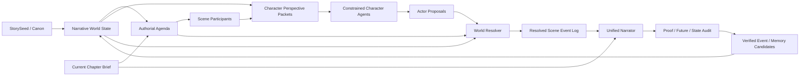

# 叙事世界、角色代理与小说写作循环

> Status: Proposed
> Updated: 2026-07-30
> Applies to: Story Novel v3 之后的新 Revision；历史 Revision 不迁移
> Related: `docs/design/narrative-memory-and-dramatic-state.md`,
> `docs/design/story-novel-episode-script.md`,
> `docs/exec-plans/active/story-novel-planning-quality-v3.md`,
> `docs/exec-plans/active/narrative-world-character-agents.md`

## 1. Decision

长篇小说下一阶段采用“权威世界模型 + 受约束角色代理 + 中央世界裁决 +
统一叙述者”的可选场景排演链路，而不是让所有角色自由运行后直接把 Agent 日志
当作正文。

核心决定：

- Canon、当前状态、事件顺序、知识边界、物件归属和未来边界仍由服务端维护，
  是唯一权威世界状态。
- 全局作者意图仍由冻结 StorySeed、章节合同和当前章 brief 决定。角色代理不能
  删除关键事件、改写终局或提前兑现未来结果。
- 只有当前场景真正参与选择、冲突或关系变化的核心人物才实例化逻辑角色代理；
  不为全书所有人物常驻运行独立进程。
- 每个角色代理只读取该角色在当前锚点可知的信息、主观信念、关系立场和当前欲望，
  不读取其他角色私有记忆、读者全知信息或未来章节计划。
- 角色代理只提出意图、行动和对话目的，不直接写小说，也不能写入世界状态。
- 中央裁决器根据当前章合同和世界状态接受、拒绝或调整提案，产出唯一、可重放的
  `scene_event_log`。
- 正文模型只读取已裁决事件、当前可见人物、叙事视角、文风和长度合同，将事件日志
  选择、压缩并写成小说；不得新增跨章持久事实。
- 正文通过语义 proof、future、Canon 和 state gate 后，才把验证过的事件和人物记忆
  写入下一章可用的叙事世界。

这是一条对现有 v3 的增量扩展。默认 `brief_only` 路径继续可用；只有需要多角色
博弈、关系化学反应或复杂信息差的场景才启用 `rehearsed_scene`。

## 2. Research boundary

本设计吸收以下研究方向，但不把论文结果误当作产品验收：

- [Narrative World Model](https://arxiv.org/abs/2607.05577) 支持使用叙事类型化
  的时间状态、知识边界、揭露顺序、关系变化和伏笔状态，并按当前写作问题检索
  chapter-safe evidence。该论文验证的是记忆问答，不是完整小说生成。
- [EvoSpark](https://aclanthology.org/2026.acl-long.1480/) 展示了长期角色社会记忆和
  Role-Location-Plot 对齐对开放叙事的价值，但开放世界涌现不能替代固定长篇的作者
  结构和审批边界。
- [Memory-Driven Role-Playing](https://aclanthology.org/2026.findings-acl.1175/)
  将角色记忆使用拆为 Anchoring、Selecting、Bounding、Enacting，支持本设计的
  角色视角包和知识边界。
- [StoryWriter](https://arxiv.org/abs/2506.16445) 与
  [DOME](https://aclanthology.org/2025.naacl-long.63/) 支持事件大纲、章级规划、
  动态历史压缩和生成反馈，但不要求角色代理拥有世界写权限。

是否提升小说质量必须通过同一 StorySeed 的 `brief_only` / `rehearsed_scene` A/B、
真实长篇生成、读者偏好和一致性指标验证。

## 3. Goals

- 让人物行为由欲望、信念、关系和知识自然驱动，而不是只为完成 key event 服务。
- 在谈判、隐瞒、对抗、合作和感情推进中产生可信的相互反应。
- 保持角色只依据自己知道的信息行动，支持误解、欺骗、戏剧反讽和延迟揭示。
- 把角色互动先解析成可审计事件，再由统一叙述者转化为文学正文。
- 保留当前 v3 的未来隔离、expected delta、局部返修、checkpoint 和 Resume 能力。
- 控制调用次数和失败半径，不把每章变成无上限多 Agent 对话。
- 让角色排演成为题材中立能力，不注入农业、施工、穿越、恋爱或其他固定内容。

## 4. Non-goals

- 不构建无终点的自主 Agent 社会或游戏服务器。
- 不让每个 NPC 常驻持有模型会话或无限增长的上下文。
- 不允许角色代理查看完整未来目录、未来状态或其他角色私有记忆。
- 不让角色代理、场景导演或正文模型直接写 Canon、`current_state` 或 Narrative
  Memory。
- 不把所有模拟动作逐条写进正文；小说叙述必须选择、压缩和重组表层表达。
- 不自动让角色自由选择一个偏离冻结大纲的结局。
- 第一阶段不新增数据库、图数据库、向量库或第三方依赖。
- 不对旧 v1-v3 Revision 静默改变 Prompt、状态或 Resume 语义。

## 5. Terms

### 5.1 Authorial Agenda

由 StorySeed、当前章节合同、当前 brief 和类型/受众策略组成的作者意图。它规定
“本章为什么存在、哪些结果必须发生、哪些未来结果不可发生”，但不逐句规定人物
如何到达结果。

### 5.2 Narrative World State

截至当前锚点已经审批或在当前 Revision 内通过 gate 的客观状态：

- 人物、物件、地点和组织；
- status、owner、location、permission、ability 和 relationship；
- 事件发生顺序与揭露顺序；
- 角色知识、信念和误解；
- 已打开/已回收伏笔和已消费里程碑。

### 5.3 Character Perspective Packet

为一个当前场景角色构建的最小私有上下文。它只包含该角色能够使用的事实、记忆、
关系立场、当前欲望、情绪延续和物理环境，并记录来源 ID/hash。

### 5.4 Actor Proposal

角色代理针对当前场景提出的意图、行动、对话目的、风险判断和可接受结果。Proposal
是建议，不是已经发生的事件，也不是状态写入。

### 5.5 World Resolution

中央裁决器对多个 Actor Proposal 做合法性、知识、地点、权限、因果和章节合同检查
后产生的唯一结果。

### 5.6 Scene Event Log

经过裁决、按顺序排列、可重放的场景事件。它描述实际发生了什么、谁观察到了什么、
哪些行动失败以及表层关系如何变化，是正文模型的事实来源。

### 5.7 Narrator

把 `scene_event_log` 转换为小说正文的统一模型角色。Narrator 服从视角策略，只能
表达当前视角允许公开的内心和信息；它不是世界状态写入者。

## 6. Invariants

1. 世界状态只有一个权威版本，角色代理没有写权限。
2. 角色只能从自己的 Perspective Packet 行动，不能从全局 Canon 的隐藏字段推断。
3. 任何角色输入都不得包含未来章节标题、事件、日期、终态或 payoff 文本。
4. Actor Proposal 必须绑定 `character_id`、输入 hash 和当前 scene contract hash。
5. Proposal 中的未知实体、越权知识和不可能地点动作在裁决前不得进入 event log。
6. 裁决后的持久结果必须是当前 `expected_delta` 的子集或等价表层实现，不能增加
   未授权的 state、knowledge、location、milestone 或 thread 变化。
7. 同一输入 hash 下的重放必须复用已 checkpoint 的 rehearsal，不重复付费调用。
8. Narrator 只能增加不改变长期状态的动作、对白、感官、即时判断和场景细节。
9. 正文未通过 gate 时，scene event log 不得成为下一章的 Canon 或角色记忆。
10. 角色记忆只从最终正文的验证 span 生成，不能直接从 Proposal 生成。
11. 临时 NPC 默认没有长期 Agent 身份或持久私有记忆。
12. 角色排演失败可以 fail closed，也可以按冻结策略降级到 `brief_only`；降级必须
    在任务启动前明确，运行时不得静默切换。

## 7. Architecture



现有 v3 路径：

```text
chapter brief -> prose -> audit -> Narrative materialization
```

提议的可选路径：

```text
chapter brief
-> scene contract
-> per-character perspective retrieval
-> actor proposals
-> world resolution
-> resolved scene event log
-> prose
-> audit
-> Narrative materialization
```

## 8. Chapter and scene execution

### 8.1 Compile scene contracts

章前规划器先把 chapter brief 分成 1–3 个可排演场景。每个 scene contract 只描述：

- scene ID、地点和相对时间范围；
- 当前参与人物和叙事视角；
- 当前欲望、冲突和必须覆盖的 beat/event；
- 本场允许、禁止和必须保持不变的长期状态；
- 本场结束时需要出现的可观察转折；
- 字符预算和允许压缩的事件。

scene contract 不包含未来章节信息，也不向角色代理透露预定的最终对白或隐藏人物
动机。

### 8.2 Select participants

只有满足至少一项条件的角色才获得独立 Actor Proposal：

- 需要在本场做有代价的选择；
- 与另一核心角色存在利益或情绪冲突；
- 持有影响本场的信息或物件；
- 本章计划授权关系弧变化；
- 其误解、隐瞒或身份会改变事件过程。

默认每场最多 2–4 个核心 Actor。群众、服务人员和一次性 NPC 由场景规划器统一
处理，除非用户把其提升为持久角色。

### 8.3 Build perspective packets

角色视角检索采用当前 scene query，而不是按章节顺序装入所有记忆。建议查询维度：

- 这个角色当前想得到或避免什么？
- 与在场人物最近的关系变化是什么？
- 角色知道哪些与本场事件直接相关的事实？
- 哪些事实读者知道但角色不知道？
- 哪些承诺、债务、恐惧、误解或未解决冲突会影响当前选择？
- 当前地点、物件和权限允许角色做什么？

Perspective Packet 示例：

```json
{
  "schema": "story_novel_character_perspective.v1",
  "scene_id": "scene-12-1",
  "character_id": "char-a",
  "world_state_hash": "sha256",
  "scene_contract_hash": "sha256",
  "public_context": [],
  "private_knowledge": [],
  "beliefs": [],
  "relationship_stances": [],
  "current_desire": "当前想得到什么",
  "current_fear": "当前想避免什么",
  "emotional_carryover": "前场情绪余波",
  "available_actions": [],
  "forbidden_fact_ids": [],
  "source_event_ids": [],
  "source_memory_ids": [],
  "source_hashes": []
}
```

检索到的记录必须来自当前 Revision 更早、`ready` 且 source hash 有效的章节。角色 A
的 Packet 不得包含角色 B 的私有记忆；Audience Disclosure 也不能自动变成角色知识。

### 8.4 Generate actor proposals

角色代理输出结构化意图，不输出小说正文：

```json
{
  "schema": "story_novel_actor_proposal.v1",
  "scene_id": "scene-12-1",
  "character_id": "char-a",
  "perspective_hash": "sha256",
  "immediate_goal": "本场目标",
  "interpretation": "如何理解当前局面",
  "intended_action": "准备采取的行动",
  "dialogue_intent": "希望对方相信或做什么",
  "concealed_intent": "可空",
  "expected_reaction": "预期对方如何回应",
  "acceptable_outcomes": [],
  "unacceptable_outcomes": [],
  "risk": "行动的代价",
  "emotional_shift_if_success": "可空",
  "emotional_shift_if_failure": "可空"
}
```

Actor Proposal 不得输出 `state_delta`，不得声明某个行动已经成功，也不能新建 Canon
ID。多个逻辑角色可以由一次模型调用分隔生成，也可以按角色独立调用；无论调用方式，
每个角色必须使用独立 Perspective Packet，不能共享隐藏上下文。

### 8.5 Resolve the world

World Resolver 分两层：

1. 确定性合法性检查：人物是否在场、是否知道所用事实、是否拥有物件/权限、移动是否
   可能、行动是否违反 Canon/future guard。
2. 受章节合同约束的场景导演：在合法 Proposal 中选择交互顺序、失败、误解、让步和
   表层转折，使 required event 自然发生。

初始版本不允许自由分支改变章节的持久结果。Resolver 决定“如何发生”，章节合同仍
决定“本章必须发生什么”。如果所有 Proposal 都无法自然完成 required event，系统将
该 scene 标记 `rehearsal_failed`，不得伪造一个成功结果。

裁决输出：

```json
{
  "schema": "story_novel_scene_resolution.v1",
  "scene_id": "scene-12-1",
  "world_state_before_hash": "sha256",
  "accepted_proposal_ids": [],
  "rejected_proposals": [
    { "proposal_id": "p1", "reason_code": "knowledge_boundary" }
  ],
  "events": [
    {
      "event_seq": 1,
      "actor_id": "char-a",
      "action": "实际发生的动作",
      "target_ids": [],
      "visible_to_character_ids": [],
      "dialogue_intent": "可空",
      "observable_result": "可观察结果",
      "bound_event_ids": [],
      "effect_contract_ids": []
    }
  ],
  "world_state_after_preview_hash": "sha256",
  "resolution_hash": "sha256"
}
```

`world_state_after_preview` 只是正文前预览。只有最终正文通过 proof/state gate 后，
服务端才应用同一 `expected_delta`。

### 8.6 Narrate resolved events

Narrator 输入仅包括：

- chapter brief 与当前 scene contract；
- resolved scene event log；
- 当前可见人物介绍、关系、动机和可表达的内心；
- POV、文风、受众、长度和 block 合同；
- 非持久化场景细节边界。

Narrator 可以：

- 合并无价值的模拟动作；
- 把意图转成自然对白和潜台词；
- 选择感官、节奏、停顿和叙述距离；
- 为已经裁决的动作增加不改变事实的过程细节。

Narrator 不可以：

- 把 rejected proposal 写成已经发生；
- 让角色说出其 Packet 中不存在的秘密；
- 改变物件归属、关系、能力、伤势、权限或地点；
- 新建未来承诺、身份或世界规则；
- 按事件日志顺序逐条写成流水账。

### 8.7 Audit and materialize

沿用 v3 的稳定 sentence ID 和服务端 `expected_delta`：

- proof audit 验证 required event、关键状态、地点和知识变化确实在正文中成立；
- actor consistency audit 验证正文行为可以由对应 Perspective Packet 和 Proposal
  解释；
- future/world audit 验证未提前兑现结果或违反规则；
- event-log conformance 验证正文没有把 rejected proposal 或未裁决持久变化写成事实；
- 只有最终正文 span 才能生成 World Event/Character Memory candidate。

角色代理的私有推理、Proposal 和未采用结果不能成为角色记忆，也不能进入后续规划。

## 9. Persistence and versioning

该设计不修改现有 v3 Revision。首个实现使用新的 opt-in 合同：

```json
{
  "schema": "story_novel_generation_plan.v4",
  "interaction_policy": {
    "mode": "brief_only|rehearsed_scene",
    "max_actor_agents_per_scene": 4,
    "max_scenes_per_chapter": 3,
    "fallback": "fail_closed|brief_only",
    "actor_model": "provider:model",
    "resolver_model": "provider:model"
  }
}
```

`story_novel_continuity.v5` 在现有章级 ledger 上增加：

- scene contract/hash；
- participant IDs；
- Perspective Packet ID/hash/source manifests；
- Actor Proposal/hash/invocation evidence；
- accepted/rejected proposal evidence；
- scene resolution/event-log/hash；
- narrator input hash；
- event-log conformance 结果；
- actor/resolver 调用数、tokens、finish reason 和 latency。

第一阶段继续复用 `generation_plan`、`continuity_ledger`、`llm_invocations` 和 Narrative
Memory 现有字段，不新增数据库表。原始 Packet/Proposal/Event Log 若超过 JSON checkpoint
预算，保存为 run artifact，并在 ledger 中保存稳定 manifest/hash；审批依赖的最小证据
必须仍在数据库可验证。

任务启动后冻结 `interaction_policy`。存在 scene rehearsal 或正文 checkpoint 后修改
角色/裁决模型、参与者上限或 fallback 必须复制为新 Revision。

## 10. Resume and invalidation

- Perspective Packet 复用条件：scene contract、world state、角色 memory snapshot、
  source manifest 和 Prompt policy hash 全部一致。
- Actor Proposal 复用条件：Perspective Packet hash 与 actor model invocation 证据一致。
- Scene Resolution 复用条件：全部 Proposal hash、world state hash、resolver policy 和
  expected delta hash 一致。
- 正文复用条件继续沿用 v3 的 brief/prose/context/body/state/source hash 链，并增加
  resolution hash。
- 角色记忆或前章状态发生变化时，从最早受影响 scene 传播 stale；不得只更新 Packet
  后继续复用旧 Proposal 或正文。
- evidence-only、candidate-only Resume 不重跑角色代理、Resolver 或正文。
- rehearsal 失败不得产生正文；正文失败不得重新运行角色代理，除非失败原因证明
  resolution 本身违反合同。

## 11. Cost and call policy

角色模拟不能无界放大每章调用数：

- `brief_only`：沿用当前 v3 调用预算。
- `rehearsed_scene` 正常章：章前 package + 一次 batched actor proposal + 一次 resolver
  - 正文 + 审计。
- 只有角色私有知识必须严格物理隔离时，才按角色独立调用；默认优先一次调用中的独立
  Packet 分区。
- 每场最多一次 Actor format repair 和一次 Resolver format repair；不能让角色互相
  无限对话。
- 只有高价值互动场景启用 rehearsal；独角戏、过场、环境探索和没有真实选择的行动
  默认使用 `brief_only`。

模型策略必须分别冻结 planning、actor、resolver、prose 和 audit 模型。便宜模型可承担
Proposal，但 Resolver、Narrator 和 Auditor 的质量不得因省成本共享未隔离上下文。

## 12. Quality gates

### 12.1 Deterministic hard gates

- Perspective Packet 不含未来信息或他人私有记忆；
- Proposal/Resolution hash 和 invocation evidence 完整；
- actor 行动的知识、地点、权限和物件前置条件成立；
- resolution 只使用当前 Canon ID 和当前合同允许的持久 effects；
- event log 覆盖当前 scene 绑定事件；
- 正文 hash、sentence proof、expected delta 和 Narrative candidate 完整；
- rejected proposal 未被正文写成事实；
- Resume 的已完成正文和 resolution hash 不变。

### 12.2 Semantic blocking gates

- 人物行为使用了其不知道的事实；
- 人物选择与已建立欲望/关系直接矛盾且正文没有给出新原因；
- 多角色反应没有因果承接，或同一角色无缘由回滚立场；
- 正文把 Proposal 中的猜测升级为客观确认；
- 叙述视角暴露了当前 POV 不可获得的内心或秘密；
- 场景结果提前兑现 future boundary。

每项 blocking 必须绑定 Perspective/Proposal/Resolution ID 和正文 sentence IDs。

### 12.3 Editorial signals

以下只用于质量报告，不自动阻断 checkpoint：

- 人物化学反应、潜台词和情绪张力；
- 角色选择是否令人意外但合理；
- 冲突是否实际改变局面；
- 日志感、重复反应和机械轮流说话；
- 爽点、节奏、留白、文风和读者追读意愿。

## 13. API and UI proposal

保持现有 Revision create/generate/resume/cancel/continuity/approval 路由。Revision 请求
未来可扩展：

```json
{
  "interaction_policy": {
    "mode": "rehearsed_scene",
    "actor_model": "provider:model",
    "resolver_model": "provider:model",
    "fallback": "fail_closed"
  }
}
```

前端在模型策略旁增加“人物互动方式”：

- 标准章前规划：成本低，适合普通章节；
- 角色场景排演：人物更独立，适合对手戏、谈判、感情和秘密场景。

逐章进度增加：

```text
chapter_planning
-> actor_rehearsal
-> world_resolution
-> prose
-> audit
-> memory_ready
-> ready
```

编辑只展示可理解的信息：参与人物、各自动机、被拒绝行动的原因、实际发生事件和
正文引用；默认不展示模型隐藏推理。

## 14. Validation plan

### 14.1 Automated

- 同一场景角色 A/B 的 Perspective Packet 具有不同知识集合；
- A 的私有记忆不会出现在 B 的 prompt evidence；
- future chapter count、future event text 和 future state outcome 在 actor prompt 中为零；
- Proposal 不能携带 state delta 或未知 Canon ID；
- Resolver 拒绝越权知识、错误地点、无物件所有权和未来结果；
- 多 Proposal 只产生一个有序 resolution；
- Narrator prompt 不含 rejected proposal 的隐藏细节；
- 正文中的持久变化是 resolution/expected delta 的子集；
- checkpoint/Resume 复用 Packet、Proposal 和 Resolution，不重复付费调用；
- 前章修改会从正确 scene 传播 stale；
- `brief_only` 与历史 v3 行为不变。

### 14.2 Real-model A/B

使用同一冻结 StorySeed、相同章节合同、相同 prose/audit 模型生成两组不少于 12 章的
样本：

- A：`brief_only`；
- B：`rehearsed_scene`。

至少覆盖谈判、合作、欺骗、感情分歧、秘密揭露和多人利益冲突。盲审比较：

- character intentionality；
- knowledge-boundary correctness；
- dialogue/subtext；
- relationship continuity；
- plot progress and engagement；
- prose naturalness；
- contradiction count；
- 每章调用数、tokens、延迟、失败率和人工修正次数。

只有 B 在人物、追读和一致性上显著改善，且成本/失败率在产品阈值内，才把 rehearsal
作为推荐模式。论文、单章 demo 或 LLM 自评不能替代盲审和真实长篇证据。

## 15. Rollout

1. 保持现有 v3 默认链路不变，先实现纯数据合同和离线 scene rehearsal evaluator。
2. 只对用户显式选择的单章重生成开放 `rehearsed_scene`，验证角色隔离和 event-log
   conformance。
3. 完成 12 章 A/B 后再决定是否进入整本新 Revision。
4. 通过真实 cancel/Resume、hash 和候选隔离后，才允许用于 48 章验收。
5. 只有审批后的 canonical Revision 才能进入 Episode/Script；Proposal 和被拒绝事件
   永不进入下游。

## 16. Open decisions

- Actor Proposal 默认一次 batched 调用是否足够隔离角色视角，还是核心秘密场景必须
  按角色独立调用？
- Resolver 初版是否完全确定性选择，还是允许模型在若干合法 interaction path 中选择？
- 是否允许用户在单章生成前编辑人物即时欲望，但不改变长期 Canon？
- 哪些 story format 默认启用 rehearsal，哪些必须由用户逐章选择？
- `scene_event_log` 的最小数据库证据与完整 artifact 保存边界如何划分？

这些问题在实现 exec plan 中决定；本设计先冻结世界权威、角色视角隔离、中央裁决和
统一叙述者四个不可逆边界。
