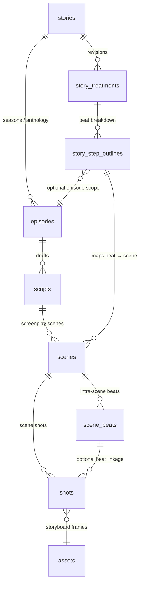

# Story → Episode → Script Data Model vs. Industry Narrative Structure

## Context
- Source task: `task.md` → Feature “叙事结构与数据模型对齐” → 需求澄清。
- Current backend reference: `ai-pic-backend/app/models/script.py` (SQLAlchemy models) and corresponding Pydantic schemas in `ai-pic-backend/app/schemas/script.py`.

## Current Implementation Snapshot
### Story (`stories`)
- Core fields: `title`, `genre`, `theme`, `target_audience`, `duration_minutes`.
- Narrative fields: `premise`, `synopsis`, `main_conflict`, `resolution`.
- Character payloads (JSON): `main_characters`, `character_relationships`.
- World-building: `setting_time`, `setting_location`, `world_building`.
- AI metadata & status: `generation_prompt`, `ai_model`, `generation_params`, `status`, `is_public`, `tags`, `extra_metadata`.
- Relations: `episodes` (1→N), `story_characters` (link to virtual IP library).

### Episode (`episodes`)
- Identification: `episode_number`, `title`, FK `story_id`.
- Narrative JSON blobs: `summary`, `plot_points`, `character_arcs`, `conflicts`.
- Tech metrics: `duration_minutes`, `scene_count`.
- AI metadata & status: mirrors `Story` fields.
- Relation: `scripts` (1→N).

### Script (`scripts`)
- Identification: `title`, FK `episode_id`.
- Content JSON blobs: `content` (full text), `scenes`, `dialogues`, `stage_directions`.
- Formatting + metrics: `format_type`, `language`, `page_count`, `word_count`, `character_count`.
- Versioning & AI: `status`, `version`, `generation_prompt`, `ai_model`, `generation_params`.
- Storyboard metadata: `storyboard_plan` (JSON), `storyboard_version`, `storyboard_updated_at`.

**Key observation**: Scene-level, beat-level, and shot-level information is stored inside generic JSON arrays without schema guarantees. There are no dedicated tables for Treatments, Step Outlines, Scenes, or Shots.

## Industry Narrative Structure (Treatment → Step Outline → Scene → Shot)
| Layer | Expected Scope | Core Required Fields |
|-------|----------------|----------------------|
| Treatment | Project-wide prose summarising story vision, tone, themes across acts | Title, logline, act summaries, protagonist goals/obstacles, thematic notes, revision/version metadata |
| Step Outline | Beat-by-beat breakdown of plot progression per episode | Step id/order, beat summary, characters involved, dramatic purpose, act reference, duration estimate |
| Scene | Screenplay conformant element describing location/time and action | Sequence/scene number, slug line (INT/EXT, location, time of day), synopsis, characters, detailed action, dialogue anchors, page estimate, associated steps |
| Shot | Cinematic planning detail under a scene | Shot id/order, type (WS/MS/CU etc.), camera movement, framing, duration, linked storyboard frame, reference assets |

Industrial workflows typically attach approval/version history at each level so editorial, production, and storyboard teams can collaborate asynchronously.

## Gap Analysis
### Missing or Underspecified Structures
- **Treatment**: No dedicated table; closest existing fields are `Story.premise`/`synopsis`. Lacks version tracking, per-act sections, creative notes, and review history.
- **Step Outline**: `Episode.plot_points` (JSON) vaguely covers beats, but lacks ordering guarantees, role metadata, or linkage to scenes.
- **Scene**: `Script.scenes` (JSON) has no schema enforcing slug metadata (INT/EXT, location, time), blocking downstream formatting and scheduling integration.
- **Shot**: Absent entirely; only `storyboard_plan` aggregates frame data without normalized shot attributes.

### Data Quality Risks
- JSON blobs allow arbitrary structures → migrations become brittle, no referential integrity.
- Lack of versioning per layer prevents tracking creative iterations (treatment revisions, scene rewrites, shot adjustments).
- Existing `storyboard_plan` mixes shot planning with script text, making it hard to drive structured approval workflows.
- No linkage between character assets (`story_characters`) and scene/shot usage, limiting consistency checks.

### Compatibility Considerations
- Historical data is embedded inside JSON columns. Migration must:
  1. Snapshot existing JSON payloads.
  2. Provide deterministic extraction rules (e.g., map `Script.scenes[*].slug` to new `scenes.slug_line`).
  3. Leave JSON columns temporarily for read fallback, or expose compatibility views/APIs until clients migrate.
- API consumers expect nested JSON responses today; new endpoints should offer both structured and legacy representations during transition (feature flag or versioned route).

## Canonical Entity Relationships

- `story_treatments` are the authoritative narrative umbrella for a story; multiple revisions coexist with status markers (draft, approved, archived).  
- `story_step_outlines` inherit the treatment context and optionally point to `episodes` so episodic and feature formats share the same table.  
- `scenes` attach to `scripts` for screenplay text while preserving a nullable `story_step_outline_id` to trace back to the plot beat.  
- `scene_beats` capture intra-scene narrative rhythm and are the bridge to shots when specific action beats need distinct coverage.  
- `shots` optionally reference both `scene_id` and `scene_beat_id`, enabling fine-grained scheduling without forcing a beat decomposition.

## Canonical Column Definitions (Draft)
### `story_treatments`
| Column | Type | Notes |
|--------|------|-------|
| `id` | PK | bigint |
| `story_id` | FK → `stories.id` | indexed, cascade delete orphan? (soft delete preferred) |
| `revision_number` | int | monotonically increasing per story |
| `status` | enum/string | e.g. draft, in_review, approved, archived |
| `title` | varchar(255) | human friendly revision title |
| `logline` | text | one-sentence pitch |
| `theme_summary` | text | thematic throughline |
| `act_structure` | jsonb | structured act I/II/III summaries |
| `target_audience_notes` | text | aligns with marketing |
| `tone_reference` | text/json | visual/audio reference pointers |
| `created_by` | FK → `users.id` | audit |
| `approved_by` | FK → `users.id` nullable | final approver |
| `ai_prompt_snapshot` | jsonb | optional generation prompt |
| `metadata` | jsonb | extensible |
| `created_at` / `updated_at` | timestamp | default utcnow |

### `story_step_outlines`
| Column | Type | Notes |
|--------|------|-------|
| `id` | PK | bigint |
| `story_id` | FK → `stories.id` | required |
| `episode_id` | FK → `episodes.id` nullable | supports episodic granularity |
| `story_treatment_id` | FK → `story_treatments.id` | required, on delete cascade |
| `sequence_number` | int | ordering within treatment or episode |
| `act_label` | varchar(50) | ACT I/IIA/etc |
| `beat_title` | varchar(255) | |
| `beat_summary` | text | |
| `dramatic_question` | text nullable | optional |
| `characters_involved` | jsonb | list of story_character ids and roles |
| `location_hint` | varchar(255) nullable | rough location |
| `duration_estimate_minutes` | numeric(5,2) nullable | |
| `status` | enum/string | draft, locked, shot |
| `metadata` | jsonb | |
| `created_by` / `updated_by` | FK → `users.id` | optional audit |
| `created_at` / `updated_at` | timestamp | |

### `scenes`
| Column | Type | Notes |
|--------|------|-------|
| `id` | PK | bigint |
| `script_id` | FK → `scripts.id` | required |
| `story_step_outline_id` | FK → `story_step_outlines.id` nullable | mapping to beat |
| `scene_number` | varchar(20) | supports alphanumeric numbering |
| `slug_line` | varchar(255) | INT./EXT. LOCATION - TIME |
| `environment_type` | enum/string | INT, EXT, INT/EXT |
| `location` | varchar(255) | normalized location name |
| `time_of_day` | enum/string | DAY, NIGHT, etc. |
| `summary` | text | |
| `page_length_eighths` | int nullable | screenplay eighths |
| `primary_characters` | jsonb | character ids ordered by prominence |
| `conflict_notes` | text nullable | |
| `ai_prompt_snapshot` | jsonb | latest generation context |
| `status` | enum/string | draft, locked, shot |
| `metadata` | jsonb | |
| `created_at` / `updated_at` | timestamp | |

### `scene_beats`
| Column | Type | Notes |
|--------|------|-------|
| `id` | PK | bigint |
| `scene_id` | FK → `scenes.id` | required |
| `order_index` | int | beat ordering |
| `beat_type` | enum/string | action, dialogue, transition |
| `beat_summary` | text | |
| `characters_involved` | jsonb | |
| `dialogue_excerpt` | text nullable | |
| `camera_notes` | text nullable | |
| `duration_seconds` | numeric(6,2) nullable | |
| `metadata` | jsonb | |
| `created_at` / `updated_at` | timestamp | |

### `shots`
| Column | Type | Notes |
|--------|------|-------|
| `id` | PK | bigint |
| `scene_id` | FK → `scenes.id` | required |
| `scene_beat_id` | FK → `scene_beats.id` nullable | optional granularity |
| `shot_number` | varchar(20) | e.g. 12A |
| `shot_type` | enum/string | WS/MS/CU etc |
| `camera_setup` | varchar(255) nullable | rig/lens info |
| `camera_movement` | enum/string | static, pan, dolly, etc |
| `framing` | text nullable | composition notes |
| `focus_subject` | varchar(255) nullable | primary subject |
| `duration_seconds` | numeric(6,2) nullable | |
| `storyboard_frame_asset_id` | FK → assets table nullable | align with existing storage |
| `lighting_notes` | text nullable | |
| `audio_notes` | text nullable | |
| `status` | enum/string | planned, scouted, shot, cut |
| `metadata` | jsonb | |
| `created_at` / `updated_at` | timestamp | |

**Indices & Constraints**  
- Composite unique per hierarchy segment:  
  - (`story_id`, `revision_number`) on `story_treatments`.  
  - (`story_treatment_id`, `sequence_number`) on `story_step_outlines`.  
  - (`script_id`, `scene_number`) on `scenes`.  
  - (`scene_id`, `order_index`) on `scene_beats`.  
  - (`scene_id`, `shot_number`) on `shots`.  
- Foreign keys should use `ON DELETE CASCADE` only where child records must disappear (e.g., beats when scene removed). Treatment revisions benefit from soft-delete flags instead of cascades to keep history.

## Suggested Work Breakdown Alignment
1. **Canonical Schema Design**  
   - Define relational models: `story_treatments`, `story_step_outlines`, `scenes`, `scene_beats`, `shots`.  
   - Enumerate mandatory columns for INT/EXT, time of day, shot type, camera move, etc.  
   - Attach revision/version tables or columns where approval workflows will hook in later tasks.
2. **Migration Strategy**  
   - Author Alembic scripts to create new tables with foreign keys linking back to `stories`, `episodes`, `scripts`.  
   - Build extraction utilities to populate seed data from existing JSON; document manual review points for malformed entries.
3. **Service & API Refactor**  
   - Introduce service-layer CRUD with clear DTOs for each layer.  
   - Keep legacy endpoints operational via compatibility serializers until frontend completes alignment.
4. **Data Contract & Documentation**  
   - Publish schema docs (this file + ER diagram) and update API docs.  
   - Outline version negotiation strategy (query param vs. new endpoint group) to answer pending questions in `task.md`.

## Open Questions to Resolve
- Do we require multiple treatments per story (version history) or single active record with revisions table?
- Should Step Outline live at story level (global) or episode level (per episodic content)?
- How do we handle shared scenes or shots across episodes (reuse vs. duplication)?
- What is the default fall-back when legacy JSON lacks required slug metadata (e.g., default to `INT./INT`)?  
  Capturing these decisions early will dictate migration scripts and API compatibility layers.

## Prototype Assets
- **Alembic draft**: `ai-pic-backend/alembic/versions/a1b2c3d4e5f6_add_story_structure_tables.py` scaffolds the normalized tables with uniqueness constraints.
- **JSON extractor**: `ai-pic-backend/scripts/prototype_story_structure_migration.py` converts Story/Episode/Script payloads into the new table shape.  
  - Sample mode (default): mirrors the previous prototype JSON output.  
  - Live mode: `python ai-pic-backend/scripts/prototype_story_structure_migration.py --mode live --script-id <id> [--insert-probe] [--dump-json]` pulls real records; `--insert-probe` runs a transactionally rolled-back insert to validate schema readiness.
